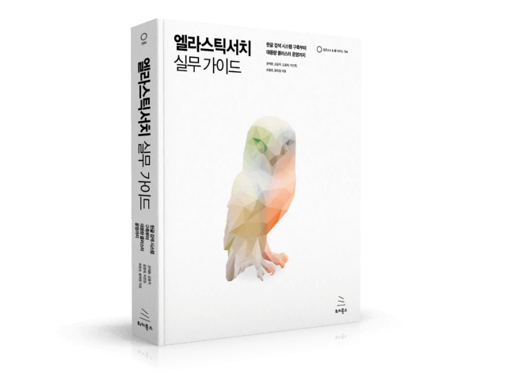

# 엘라스틱서치 실무 가이드

> 책 "엘라스틱서치 실무 가이드"와 함께 "엘라스틱 스택"에 대해 공부합니다.

## 목차

01. [검색 시스템 이해하기]()
02. [엘라스틱서치 살펴보기]()
03. [데이터 모델링]()
04. [데이터 검색]()
05. [데이터 집계]()
06. [고급 검색]()
07. [한글 검색 확장 기능]()
08. [엘라스틱서치 클라이언트]()
09. [엘라스틱서치와 루씬 이야기]()
10. [대용량 처리를 위한 시스템 최적화]()
11. [장애 방지를 위한 실시간 모니터링]()
12. [안정적인 클러스터 운영 노하우]()
13. [클러스터 성능 측정]()
