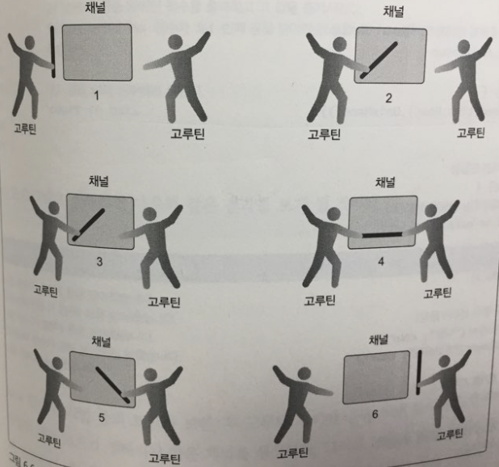

# 동시성


> 책 "Go In Action"을 공부하면서 정리한 문서입니다.


## 프로세스와 스레드, 동시성과 병렬성

`Go`에서의 동시성 처리 동기화는 `CSP`라는 패러다임에서 비롯되었다. `CSP`는 간단하게 말해, 동시 접근에 대해 잠금으로 처리하는 것이 아닌, 메세지를 전달하는 방식이다. 이 메세지를 전달하는 통로가 바로 "채널"이다.


위의 그림은 **프로세스**의 모습이다. 메모리 주소 공간, 파일 및 장치, 스레드에 대한 핸들을 비롯해 다양한 것이 포함된다. **스레드는 코드로 작성한 함수를 실행하기 위해 운영체제가 예약해둔 실행 경로**이다. 프로세스는 최소 하나의 스레드를 지닌다. (스레드는 프로세스의 포함됨) 
 


위의 그림은, `Go 런타임 스케줄러`는 하나의 운영체제 스레드에 바인딩된 논리적 프로세서에서 고루틴이 실행될 수 있게 예약함을 보여준다. 보통 다음의 순서를 따른다.

1) 고루틴이 생성된다.
2) 고루틴이 실행할 준비가 되면 스케줄러의 `Global Run Queue`에 위치한다.
3) 논리 프로세서가 고루틴을 큐에서 빼와서 실행한다.


위의 그림은 파일을 여는 등의 자신의 실행을 중단해야 하는 시스템 콜을 수행하는 경우를 보여준다. 다음의 순서를 따른다.

1) 논리 프로세서와 고루틴이 분리된다.
2) 스레드는 시스템 콜이 리턴될 때까지 대기한다. 
3) 논리 프로세서는 할당된 스레드가 없기 때문에, 스케줄러에서 새로운 스레드를 생성한다.
4) 새로운 스레드를 논리 프로세스에 연결한 후 `Local Run Queue`에서 다른 고루틴을 선택하여 실행한다.
5) 시스템 콜이 리턴되면 실행 중인 고루틴은 다시 `Local Run Queue`로 이동한다.

5번이 실행될 때, 다시 사용될 것을 대비하여 고루틴이 실행 중이던 스레드도 함꼐 보관된다.


위의 그림은 동시성과 병렬성의 차이를 보여준다. 이 둘은 다른 개념이다. 병렬성은 여러 논리 프로세스서에서 동시에 실행된다. 동시성은 한 번에 여러 작업을 수행하는 것을 말한다. 

보통 운영체제와 하드웨어에 가해지는 부담이 적기 때문에 동시성 처리가 병렬성 처리보다 성능이 우수한 경우가 많다.


## 고루틴

`고루틴`은 일종의 경량 스레드이다. 쓰는 방법은 쉽다. 함수 호출 앞에 `go` 라는 키워드만 붙이면 된다.

다음 예제를 보자.

```go
package main

import (
	"fmt"
	"runtime"
	"sync"
	"time"
)

func main() {
	// 스케줄러가 사용할 하나의 논리 프로세스 할당
	runtime.GOMAXPROCS(1)

	// wg는 프로그램 종료를 대기하기 위해 사용
	// 고루틴 개수만큼 더해준다.
	var wg sync.WaitGroup
	wg.Add(2)

	fmt.Println("고루틴 시작!")

	go func() {
		// main 함수에 종료를 알리기 위해 Done 함수 호출
		defer wg.Done()

		// 소문자를 3번 출력한다.
		for count := 0; count < 3; count++ {
			time.Sleep(3 * time.Second)
			for char := 'a'; char < 'a'+26; char++ {
				fmt.Printf("%c ", char)
			}
			fmt.Println()
		}
	}()

	go func() {
		// main 함수에 종료를 알리기 위해 Done 함수 호출
		defer wg.Done()

		// 대문자를 3번 출력한다.
		for count := 0; count < 3; count++ {
			time.Sleep(3 * time.Second)
			for char := 'A'; char < 'A'+26; char++ {
				fmt.Printf("%c ", char)
			}
			fmt.Println()
		}
	}()

	fmt.Println("고루틴 대기 중")
	wg.Wait()

	fmt.Println("고루틴 끝~!")
}
```

한 코드 한 코드 뜯어서 보자.

```go
runtime.GOMAXPROCS(1)
```

위 코드는 주석에도 적혀져 있지만, 논리 프로세스의 개수를 조절하는 것이다. 따라서 이 프로그램이 실행되면 단 하나의 논리 프로세스가 할당된다.

```go
var wg sync.WaitGroup
wg.Add(2)

fmt.Println("고루틴 시작!")
// ...


fmt.Println("고루틴 대기 중")
wg.Wait()

fmt.Println("고루틴 끝~!")
```

`WaitGroup`은 "카운팅 세마포어"라는 방식으로 고루틴이 종료될 때까지 메인 스레드가 유지되게끔 한다. 고루틴의 개수만큼 `WaitGroup`에 추가해주어야 하며, `Wait`를 호출해야 설정한 개수만큼 고루틴이 끝날 때까지 대기한다. 

```go
// ...
go func() {
		// main 함수에 종료를 알리기 위해 Done 함수 호출
    defer wg.Done()

    // 소문자를 3번 출력한다.
    for count := 0; count < 3; count++ {
        time.Sleep(3 * time.Second)
        for char := 'a'; char < 'a'+26; char++ {
            fmt.Printf("%c ", char)
        }
        fmt.Println()
    }
}()
// ...
```

`defer`를 사용해서 고루틴이 종료 시에 `WaitGroup.Done`을 호출하여 고루틴이 끝났음을 알린다. 이는 익명 함수로써 소문자를 3번 출력하고 끝이 난다. 아래 익명함수는 대문자를 출력하고 끝이난다.

프로그램을 실행해보면, 3초마다 대문자/소문자 출력이 무작위로 출력되는 것을 볼 수 있다. 다음은 내 로컬 머신에서 프로그램을 실행시킨 결과이다.

```
고루틴 시작!
고루틴 대기 중
a b c d e f g h i j k l m n o p q r s t u v w x y z 
A B C D E F G H I J K L M N O P Q R S T U V W X Y Z 
A B C D E F G H I J K L M N O P Q R S T U V W X Y Z 
a b c d e f g h i j k l m n o p q r s t u v w x y z 
a b c d e f g h i j k l m n o p q r s t u v w x y z 
A B C D E F G H I J K L M N O P Q R S T U V W X Y Z 
고루틴 끝~!
```


## 경쟁 상태와 락 기법

이런 동시성 처리를 할 때 주의할 점이 있다. 스레드끼리는 자원을 공유하기 때문에, 일종의 `경쟁 상태(Race Condition)`라고 불리우는 골치 아픈 문제가 발생한다. 아래 예제를 보자.

```go
package main

import (
	"fmt"
	"runtime"
	"sync"
)

var (
	counter int
	wg      sync.WaitGroup
)

func intCounter(id int) {
	defer wg.Done()

	for count := 0; count < 2; count++ {
		value := counter
		runtime.Gosched()
		value++
		counter = value
	}
}

func main() {
	wg.Add(2)

	go intCounter(1)
	go intCounter(2)

	wg.Wait()
	fmt.Println("Result: ", counter)
}
```

쉽게 설명하면, 고루틴 2개가 번갈아가면서 실행되면서 `counter`의 값을 각각 2번씩 반복하면서 1씩 증가시키는 프로그램이다. 그런데 코드를 실행해보면 결과는 4 혹은 2가 나온다. 4가 나올 때가 정상 결과이며, 2가 나올 때는 "경쟁 상태"에 걸려 에러가 난 것이다.


위의 그림은 앞선 예제에서 `counter`가 고루틴 2개에 의해서 덮어 씌어지는 것을 보여준다. (이것이 바로 "경쟁 상태"이다.)

`Go`는 `go run` 혹은 `go build` 명령 시에 이런 경쟁 상태를 트레이싱할 수 있는 옵션을 제공한다. `-race`를 붙이면 된다.

```bash
# go run -race 파일
$ go run -race example.go
==================
WARNING: DATA RACE
Read at 0x00000127f540 by goroutine 8:
  main.intCounter()
      /Users/gurumee/Studies/go-in-action/ch06/example_06_02_race_condition.go:18 +0x79

Previous write at 0x00000127f540 by goroutine 7:
  main.intCounter()
      /Users/gurumee/Studies/go-in-action/ch06/example_06_02_race_condition.go:21 +0x9a

Goroutine 8 (running) created at:
  main.main()
      /Users/gurumee/Studies/go-in-action/ch06/example_06_02_race_condition.go:29 +0x89

Goroutine 7 (finished) created at:
  main.main()
      /Users/gurumee/Studies/go-in-action/ch06/example_06_02_race_condition.go:28 +0x68
==================
Result:  4
Found 1 data race(s)
exit status 66
```

실제 실행 시 레이스 컨디션을 트레이싱 하게 해보았다. 예상대로 `intCounter` 함수에서 레이싱 컨디션이 발생할 수 있다고 경로를 띄우고 있다.

이런 해결책으로 "공유 자원 기법(Lock 기법)"이라는 방법이 있다. 먼저 `atomic`을 사용하는 것이다. 다음 코드를 보자.

```go
package main

import (
	"fmt"
	"runtime"
	"sync"
	"sync/atomic"
)

var (
	counter int64
	wg      sync.WaitGroup
)

func intCounter(id int) {
	defer wg.Done()

	for count := 0; count < 2; count++ {
		atomic.AddInt64(&counter, 1)
		runtime.Gosched()
	}
}

func main() {
	wg.Add(2)

	go intCounter(1)
	go intCounter(2)

	wg.Wait()
	fmt.Println("Result: ", counter)
}
```

`atomic`은 정수 및 포인터에 대한 접근을 동기화할 수 있는 저수준의 잠금 매커니즘을 제공한다.

위 코드처럼 경쟁 상태에 놓여 있는 변수에 일종의 락을 걸어서 연산이 끝난 후 락을 해제한다. 그래서 경쟁 상태를 발생하지 않게 한다. 실제 위의 파일을 `-race` 옵션으로 실행해주면 해당 경고들이 사라짐을 볼 수 있다.

```bash
go run -race example.go
Result:  4
```

다른 잠금 기법은 `뮤텍스`를 활용하는 것이다. 이는 `상호 배타(mutual exclusion` 개념을 추상화한 것이다. 어떤 임계 지역을 생성하여 이 지역에는 하나의 고루틴만 통과할 수 있게 만들어두는 것이다. 코드를 보자.

```go
package main

import (
	"fmt"
	"runtime"
	"sync"
)

var (
	counter int64
	wg      sync.WaitGroup
	mutex   sync.Mutex
)

func intCounter(id int) {
	defer wg.Done()

	for count := 0; count < 2; count++ {
		mutex.Lock()
		{
			value := counter
			runtime.Gosched()
			value++
			counter = value
		}
		mutex.Unlock()
	}
}

func main() {
	wg.Add(2)

	go intCounter(1)
	go intCounter(2)

	wg.Wait()
	fmt.Println("Result: ", counter)
}
```

`intCounter`를 자세히 보자.


```go
func intCounter(id int) {
	defer wg.Done()

	for count := 0; count < 2; count++ {
        // 임계 부분 시작 점
		mutex.Lock()
		{
			value := counter
			runtime.Gosched()
			value++
			counter = value
        }
        // 임계 부분 끝 점
		mutex.Unlock()
	}
}
```

`mutex.Lock` 이후 부터는 임계 지역에 들어간다. `mutex.Unlock` 호출 이후 임계 지역이 풀린다. 물론 이런 방법들이 훌륭하긴 하지만 여전히 어렵다. 

잠금 기법의 경우, 잠금을 적절히 해제하지 않으면 "데드락"이라는 심각한 문제를 초래하게 된다. 그래서 조심 또 조심해서 코딩을 해야 한다.


## 채널

잠금 기법은 동기화 문제에서 제일 골치 아픈 "경쟁 상태"를 훌륭하게 해결한다. 하지만. `Go`의 전체적인 방향인, 쉽고 오류가 적으며 재미있는 프로그래밍으로 보기에는 다소 무리가 있다.

"채널"이란 기능은 고루틴 사이의 동기화를 지원하는 또 다른 방식 중 하나이다. 채널은 다음과 같이 `make(chan <Type>, <버퍼 개수>)`로 만들 수 있다.

```go
// 버퍼의 크기가 정해지지 않은 정수 채널
unbuffered := make(chan int)

// 버퍼의 크기가 정해진 정수 채널
buffered := make(chan int, 10)
```

채널에 값을 보내려면 `<-` 연산자를 호출하면 된다. `채널 <- 값` 형태이다.

```go
unbuffered := make(chan int)
unbuffered <- 5
```

채널에서 값을 꺼내려면, 반대로 `변수 <- 채널` 형태로 연산자를 호출하면 된다.

```go
value := <- unbuffered
```

### 버퍼가 없는 채널 vs 버퍼가 있는 채널

**버퍼가 없는 채널**은 값을 전달 받기 전에 어떤 값을 얼마나 보유할 수 있을지 크기가 결정되지 않은 채널이다. 



버퍼가 없는 채널은, 위의 그림처럼 채널에 값을 보내거나 받기 전에 값을 전달하는 고루틴과 전달 받는 고루틴이 같은 시점에 채널을 사용할 수 있어야 한다.

예제를 살펴보자.

```go
package main

import (
	"fmt"
	"math/rand"
	"sync"
	"time"
)

var wg sync.WaitGroup

func init() {
	rand.Seed(time.Now().UnixNano())
}

func main() {
	// 버퍼 없는 채널 생성
	court := make(chan int)
	// 고루틴 당 하나씩 총 2개의 카운터
	wg.Add(2)

	go player("나딜", court)
	go player("죠코비치", court)

	court <- 1
	wg.Wait()
}

func player(name string, court chan int) {
	defer wg.Done()

	for {
		ball, ok := <-court

		if !ok {
			fmt.Printf("%s 선수가 승리했습니다.\n", name)
			return
		}

		n := rand.Intn(100)

		if n%13 == 0 {
			fmt.Printf("%s 선수가 공을 받아치지 못했습니다.\n", name)
			//채널을 닫는다.
			close(court)
			return
		}

		fmt.Printf("%s 선수가 %d 번째 공을 받아쳤습니다.\n", name, ball)
		ball++

		court <- ball
	}
}
```

차례 차례 살펴보자.

```go
func main() {
	// 버퍼 없는 채널 생성
	court := make(chan int)
	// 고루틴 당 하나씩 총 2개의 카운터
	wg.Add(2)

	// 고루틴들 준비 상태 완료
	go player("나딜", court)
	go player("죠코비치", court)

	// 게임 시작! 채널도 송수신 준비 완료
	court <- 1
	wg.Wait()
}
```

먼저, 두 고루틴 사이에서 공을 쳐낸 횟수를 교환하기 위해서, 버퍼가 없는 채널을 생성하였다. 

또한 두 고루틴이 끝날때까지 대기하기 위해 카운터 2를 `WaitGroup`에 추가한다. 

이제 `player` 함수를 고루틴에 실어내고 그리고 채널 `court`에 1을 전송하여 게임을 시작한다.

이후, `player`에서 패배가 결정날 때까지 이 작업이 반복된다.

```go
func player(name string, court chan int) {
	defer wg.Done()

	for {
		ball, ok := <-court

		if !ok {
			fmt.Printf("%s 선수가 승리했습니다.\n", name)
			return
		}

		n := rand.Intn(100)

		if n%13 == 0 {
			fmt.Printf("%s 선수가 공을 받아치지 못했습니다.\n", name)
			//채널을 닫는다.
			close(court)
			return
		}

		fmt.Printf("%s 선수가 %d 번째 공을 받아쳤습니다.\n", name, ball)
		ball++

		court <- ball
	}
}
```

`player` 함수는 무한 반복을 돌면서, 채널 `court`가 더 이상 수신 받는 `ball`이 없으면 이기는 것으로 끝을 낸다. 

또한, 100개의 무작위 수를 뽑아서 13으로 나누었을 때 나머지가 없다면 패배한 것으로 끝을 낸다. 이때 채널을 닫아버림으로써, 더 이상 `ball`을 전송하지 않는다. 

승리/패배가 결정이 나지 않는다면, `ball`을 1 올린 후 채널 `court`에 전송한다.


**버퍼가 있는 채널**은 고루틴이 값을 받아가기 전까지 채널에 보관할 수 있는 값의 개수를 지정할 수 있다. 


위의 그림은, 버퍼가 있는 채널이 송수신하는 모습을 보여준다. 이 채널은 송수신 과정이 반드시 동시에 이루어질 필요는 없다. 

여기서 중요한 것은 잠금이 실행되는 방법의 차이가 있는데, 일단 데이터를 받는 작업에서 잠금은 채널 내에 받아갈 값이 없을 때 일어난다. 

데이터를 보내는 작업에서 잠금은 버퍼가 가득 차서 더 이상 값을 보관할 수 없을 때 일어난다. **버퍼가 없는 채널은 데이터를 송수신이 동시에 이루어지지만 버퍼가 있는 채널은 동시에 일어남을 보장하지 않는다는 것**이다.

다음 예제를 살펴보자.

```go
package main

import (
	"fmt"
	"math/rand"
	"sync"
	"time"
)

const (
	numberOfGorouines = 4
	taskLoad          = 10
)

var wg sync.WaitGroup

func init() {
	rand.Seed(time.Now().Unix())
}

func main() {
	// 채널생성, 10개의 값을 보관 가능
	tasks := make(chan string, taskLoad)
	// 4개의 고루틴이 실행됨
	wg.Add(numberOfGorouines)

	// 4개의 고루틴 실행
	for gr := 1; gr <= numberOfGorouines; gr++ {
		go worker(tasks, gr)
	}

	// 10개의 작업을 채널에 송신
	for post := 1; post <= taskLoad; post++ {
		tasks <- fmt.Sprintf("작업: %d", post)
	}

	close(tasks)
	wg.Wait()
}

func worker(tasks chan string, worker int) {
	defer wg.Done()

	for {
		// 채널에서 값을 꺼냄.
		task, ok := <-tasks

		// 채널이 닫혔다면, 고루틴 종료
		if !ok {
			fmt.Printf("작업자 :%d : 종료합니다.\n", worker)
			return
		}

		// 작업 실행
		fmt.Printf("작업자 :%d : 작업 시작 :%s\n", worker, task)
		sleep := rand.Int63n(100)
		time.Sleep(time.Duration(sleep) * time.Microsecond)

		fmt.Printf("작업자 :%d : 작업 완료 :%s\n", worker, task)
	}
}
```

역시 하나 하나 뜯어보자.

```go
func main() {
	// 채널생성, 10개의 값을 보관 가능
	tasks := make(chan string, taskLoad)
	// 4개의 고루틴이 실행됨
	wg.Add(numberOfGorouines)

	// 4개의 고루틴 실행
	for gr := 1; gr <= numberOfGorouines; gr++ {
		go worker(tasks, gr)
	}

	// 10개의 작업을 채널에 송신
	for post := 1; post <= taskLoad; post++ {
		tasks <- fmt.Sprintf("작업: %d", post)
	}

	close(tasks)
	wg.Wait()
}
```

먼저, 10개의 데이터를 보관할 수 있는 버퍼가 있는 채널 `tasks`를 생성한다. 그리고 고루틴 4개를 실행하기 때문에, `WaitGroup`의 개수를 추가한다.

이후 `worker` 함수를 총 4번 고루틴에 실어준다.

그리고 10개의 태스크를 채널에 전송한다. 이후 채널을 닫고 고루틴이 종료할 때까지 기다린다. **실제로 채널이 닫히더라도 고루틴은 채널에서 데이터를 계속 받을 수 있다.** 이제 실제 그 태스크를 처리하는 `worker` 함수를 살펴보자.

```go
func worker(tasks chan string, worker int) {
	defer wg.Done()

	for {
		// 채널에서 값을 꺼냄.
		task, ok := <-tasks

		// 채널이 닫혔다면, 고루틴 종료
		if !ok {
			fmt.Printf("작업자 :%d : 종료합니다.\n", worker)
			return
		}

		// 작업 실행
		fmt.Printf("작업자 :%d : 작업 시작 :%s\n", worker, task)
		sleep := rand.Int63n(100)
		time.Sleep(time.Duration(sleep) * time.Microsecond)

		fmt.Printf("작업자 :%d : 작업 완료 :%s\n", worker, task)
	}
}
```

`worker` 함수는 채널에 더 이상 데이터를 수신 받을 수 없을 때까지 무한 반복된다. 먼저 채널이 비었다면, 고루틴을 종료한다.

그리고 태스크를 처리할 때 약간의 시간을 주어 어느 정도 고르게 4개의 고루틴이 채널의 데이터를 꺼내서 처리하게 만들었다. 실제 코드를 실행하면 4개의 고루틴이 번갈아가면서 데이터를 처리하는 것을 확인할 수 있다.