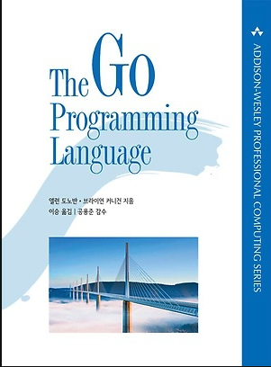

# The Go Programming Language 정리

> 책 "The Go Programming Language"을 공부하면서 정리한 문서입니다.

## 목차

01. [튜토리얼](./01-tutorial/01-tutorial.md)
02. [프로그램 구조]()
03. [기본 데이터 타입]()
04. [복합 타입]()
05. [함수]()
06. [메소드]()
07. [인터페이스]()
08. [고루틴과 채널]()
09. [공유 변수를 이용한 동시성]()
10. [패키지와 Go 도구]()
11. [테스트]()
12. [리플렉션]()
13. [저수준 프로그래밍]()

