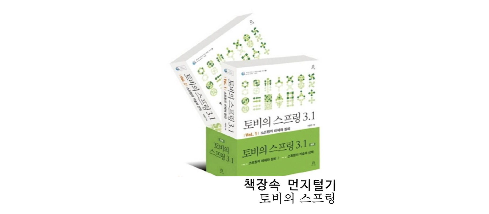
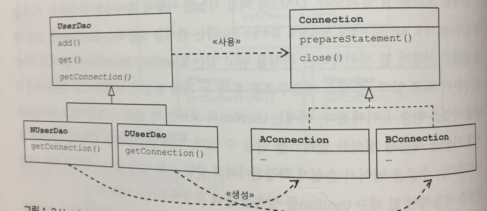
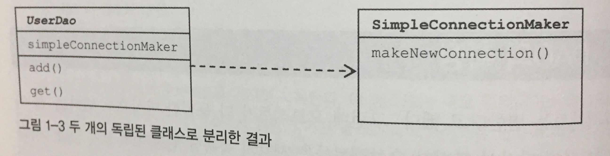
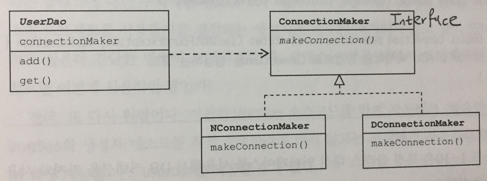
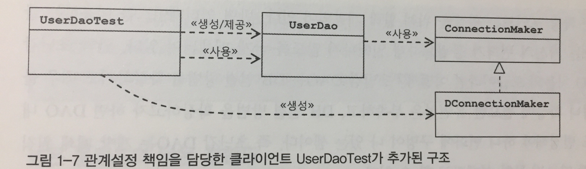

# 오브젝트와 의존관계 (1)



> 책장속 먼지털기 스터디 1차
> 스터디 날짜 : 2020.11.09
> 작성 날짜 : 2020.11.08 ~ 09
> 페이지 : 53 ~ 102


## 초 간단!하지만, 초 난감한 DAO를 만들어보자

책에 나온대로, id, name, password 세 개의 프로퍼티를 가진 `User`클래스를 만든다.

```java
@NoArgsConstructor @AllArgsConstructor 
@Getter @Setter @ToString @EqualsAndHashCode
public class User {
    private String id;
    private String name;
    private String password;
}
```

> 참고! 자바 빈이란
> 
> 위의 User 클래스는 자바빈이라고 부를 수 있습니다. 간단하게, 다음의 조건이 충족되면 자바빈이라고 말합니다.
> 1) 디폴트 생성자를 갖고 있어야 한다.
> 2) 빈이 노출하는 이름을 가진 속성, 즉 프로퍼티를 get-set으로 제공해주어야 한다.

위 엔티티를 `RDB`의 테이블로 표현하면 다음과 같다.

| Filed Name | Type | Setting |
| :-- | :-- | :-- |
| id | VARCHAR(10) | Primary Key |
| name | VARCHAR(20) | Not Null |
| password | VARCHAR(20) | Not Null |

만약 데이터베이스에 테이블을 만들어야 한다면 다음의 `SQL`을 이용하면 된다.

```sql
create table users (
    id varchar(10) primary key,
    name varchar(20) not null,
    password varchar(20) not null
);
```
이제 이를 데이터베이스에 저장하거나 읽어올 수 있는 DAO를 만들어보자.

> 참고! DAO란?
> 
> Data Access Object의 약자로써, DB를 사용해 데이터를 조회하거나 조작하는 기능을 전담하는 오브젝트를 말합니다. 

코드는 다음과 같다.

```java
import java.sql.*;

public class UserDao {
    public void add(User user) throws ClassNotFoundException, SQLException {
        Class.forName("com.mysql.jdbc.Driver");
        Connection c = DriverManager.getConnection(
                "jdbc:mysql://localhost/springbook", "spring", "book");

        PreparedStatement ps = c.prepareStatement("insert into users(id, name, password) values(?, ?, ?)");
        ps.setString(1, user.getId());
        ps.setString(2, user.getName());
        ps.setString(3, user.getPassword());
        ps.executeUpdate();

        ps.close();
        c.close();
    }

    public User get(String id) throws ClassNotFoundException, SQLException {
        Class.forName("com.mysql.jdbc.Driver");
        Connection c = DriverManager.getConnection(
                "jdbc:mysql://localhost/springbook", "spring", "book");

        PreparedStatement ps = c.prepareStatement("select * from users where id = ?");
        ps.setString(1, id);

        ResultSet rs = ps.executeQuery();
        rs.next();
        User user = new User();
        user.setId(rs.getString("id"));
        user.setName(rs.getString("name"));
        user.setPassword(rs.getString("password"));

        rs.close();
        ps.close();
        c.close();

        return user;
    }
}
```

위 코드에서, JDBC를 이용한 작업의 일반적인 순서를 알 수 있다.

1. 메서드 시그니처에, 예외를 적어준다.(혹은 코드 블럭을 try-catch로 묶어준다)
2. DB 연결을 위한 Connection을 가져온다.
3. SQL을 담은 Statement/PreparedStatement를 만든다.
4. 만들어진 Statement를 실행한다.
5. Get의 경우, ResultSet을 받아서 정보를 저장할 오브젝트로 옮긴다.
6. 작업을 마친 후, 리소스를(ResultSet, Statement, Connection 등) 해제한다.

이제, 작성한 코드를 테스트해보자. 제일 간단하게는 역시 `main`코드를 클래스 내부에 작성하여, 실행시키는 것이다. `UserDao` 클래스에 다음을 작성하자.

```java
public class UserDao {
    // ...

    public static void main(String[] args) throws SQLException, ClassNotFoundException {
        UserDao dao = new UserDao();

        User user = new User("gurumee", "hyunwoo", "ilovespring");
        dao.add(user);
        System.out.println(user.getId() + " register success");

        User user2 = dao.get("gurumee");
        System.out.println(user2.getName() + " " + user2.getPassword());
        System.out.println(user2.getId() + " query success");
    }
}
```

그 후, 코드를 실행해보면, 다음의 결과를 얻을 수 있다.

```bash
gurumee register success
hyunwoo ilovespring
gurumee query success
```

책의 코드는 `MySQL`과, `MySQL`의 `JDBC` 라이브러리인 `mysql:mysql-connector-java`을  사용한다. 로컬/도커를 활용해서 `MySQL`을 설치하고, 아까 살펴봤던 `SQL`을 통해 User 테이블을 만들고 실행을 해야 옳은 결과를 얻을 수 있을 것이다.

그러나 이 코드는 문제점이 많다. 이를 "객체 지향"적으로 리팩토링해보자.


## DAO의 분리(feat. 상속)

프로그래밍 기초 개념 중 "관심사의 분리"라는 것이 있다. 프로그래밍적으로 말하자면, 관심이 같은 것끼리 모이게 하고, 따로 떨어져 있는 관심끼리는 영향을 주지 않고 분리하는 것을 말한다.

위 `초난감 DAO`에서 세 가지 관심 사항을 발견할 수 있다.

1. DB와 연결을 위한 커넥션을 어떻게 가져오는가
2. DB에 SQL문장을 어떻게 만들고 실행하는가
3. 작업이 끝나면 리소스들을 어떻게 해제할 것인가

이 중 1번에 해당하는 관심사를 분리해보자. 

### 중복 코드를 메서드로 분리하자.

먼저, 연결을 가져오는 중복 코드를 다음과 같이 메서드로 분리한다.

```java
public class UserDao {
    public void add(User user) throws ClassNotFoundException, SQLException {
        Connection c = getConnection();

        // ...
    }

    public User get(String id) throws ClassNotFoundException, SQLException {
        Connection c = getConnection();

        //...
    }

    private Connection getConnection() throws ClassNotFoundException, SQLException {
        Class.forName("com.mysql.jdbc.Driver");
        return DriverManager.getConnection(
                "jdbc:mysql://localhost/springbook", "spring", "book");
    }

    // ...
}
```

위에서 말했듯이 `add`와 `get`에서 중복되는 코드이자, 공통 관심사는 "DB 커넥션을 어떻게 가져오는가" 이다. 그래서 그 공통 코드를 메서드로 분리했다. 

```java
private Connection getConnection() throws ClassNotFoundException, SQLException {
    Class.forName("com.mysql.jdbc.Driver");
    return DriverManager.getConnection(
            "jdbc:mysql://localhost/springbook", "spring", "book");
}
```

> 참고!
> 
> 인텔리J 기준, cmd + control + m을 누르면 코드를 메서드로 추출할 수 습니다. 아니면, cmd + shift + a를 누른 후 extract method 로 해당 기능을 검색할 수 있습니다.

`UserDao`는 2개의 메소드 밖에 없기 때문에, 티는 안나지만 메서드가 많이 있다고 가정해보자. 이 때, DB 커넥션의 방법을 수정해야 하는 상황이 벌어졌을 때, 메서드를 추출하지 않았다면 어떤 일이 벌어졌겠는가?

메서드를 추출한 지금, 해당 관심사를 담당하는 메서드인 `getConnection`만 수정하면 된다. 하지만 메서드 추출 전이라면, 많은 메서드를 찾아 다니면서 변경을 해야 한다. 이러한 불편함을 제거한 것이다. 

여기에 한 가지 더 리팩토링을 했으면, 반드시 테스트를 통해서 코드가 동작하는지 검증해야 한다. 작성한 main 코드를 돌려보자. 잘 동작하면 다음으로 넘어가자. (돌려보기 전에 DB에 있는 데이터는 삭제하길 바란다.)

### 팩토리 메서드 패턴을 이용해서 UserDao의 getConnection을 분리해보자.

먼저 `UserDao`를 다음과 같이 추상 클래스로 변경한다.

```java
public abstract class UserDao {
    public void add(User user) throws ClassNotFoundException, SQLException {
        // ...
    }

    public User get(String id) throws ClassNotFoundException, SQLException {
        // ...
    }

    public abstract Connection getConnection() throws ClassNotFoundException, SQLException;

    // ...
}
```

`getConnection`을 추상 메서드로 만들어 `UserDao` 클래스를 상속하는 클래스에게 구현을 위임하게 만든다. 책에서처럼 `NUserDao`, `DUserDao`처럼 나눈다고 했을 때, 클래스 구조는 다음과 같이 변한다.


이를 상속하는 `GeneralUserDao`를 만들어보자.

```java
public class GeneralUserDao extends UserDao {
    public Connection getConnection() throws ClassNotFoundException, SQLException {
        Class.forName("com.mysql.jdbc.Driver");
        return DriverManager.getConnection(
                "jdbc:mysql://localhost/springbook", "spring", "book");
    }
}
```

만약, 여러 `UserDao`를 만들어야 한다고 할 때, `GeneralUserDao`처럼, `getConnection` 메서드를 구현하기만 하면 된다. 

이제 다시 테스트다. main 메서드를 다음과 같이 수정한다.

```java
public abstract class UserDao {
    // ...

    public abstract Connection getConnection() throws ClassNotFoundException, SQLException;

     public static void main(String[] args) throws SQLException, ClassNotFoundException {
        UserDao dao = new GeneralUserDao();

        User user = new User("gurumee", "hyunwoo", "ilovespring");
        dao.add(user);
        System.out.println(user.getId() + " register success");

        User user2 = dao.get("gurumee");
        System.out.println(user2.getName() + " " + user2.getPassword());
        System.out.println(user2.getId() + " query success");
    }
}
```

이처럼, `UserDao` 수정 없이 새로운 커넥션을 만드는 서브 클래스들을 만들 수 있다. 조금 더 유연한 코드가 되었다.

이렇게 슈퍼클래스의 기본적인 로직의 흐름을 만들고, 기능의 일부를 추상 메소드나 오버라이딩 가능한 protected 레벨의 메서드를 만든 뒤 서브 클래스의 위임하는 방식을 **템플릿 메서드 패턴**이라고 한다.

또는, 서브 클래스에서 구체적인 오브젝트 생성하게 하는 방식인 **팩토리 메서트 패턴**으로도 볼 수 있다. 팩토리 메서드 패턴의 관점으로 봤을 때, 클래스 다이어그램은 이렇게 구성할 수 있다.



내 코드로는 `GeneralUserDao`는 `Connection G`를 만든다고 볼 수 있다. 위에 나온 디자인 패턴의 설명은 다음을 참고하라.

- [템플릿 메서드 패턴](https://gmlwjd9405.github.io/2018/07/13/template-method-pattern.html)
- [팩토리 메서드 패턴](https://gmlwjd9405.github.io/2018/08/07/factory-method-pattern.html)


## DAO의 확장(feat. 컴포지션)

상속을 통한 확장은 쉬우나, 좋지 않다. 책 "Effective Java"에서는 상속보다, 컴포지션을 활용해서 클래스를 확장하는 것을 추천하고 있다. 조금 더 유연한 코드를 작성할 수 있기 때문이다. 이번엔 이렇게 분리해보자.



먼저 `SimpleConnectionMaker`를 다음과 같이 만든다.

```java
public class SimpleConnectionMaker {
    public Connection makeNewConnection() throws ClassNotFoundException, SQLException {
        Class.forName("com.mysql.jdbc.Driver");
        return DriverManager.getConnection(
                "jdbc:mysql://localhost/springbook", "spring", "book");
    }
}
```

그 다음 `UserDao`를 다음과 같이 수정하자. 다시 추상 클래스에서, 구체 클래스로 변경한다.

```java
public class UserDao {
    private SimpleConnectionMaker simpleConnectionMaker;

    public UserDao() {
        simpleConnectionMaker = new SimpleConnectionMaker();
    }

    public void add(User user) throws ClassNotFoundException, SQLException {
        Connection c = simpleConnectionMaker.makeNewConnection();
        // ...
    }

    public User get(String id) throws ClassNotFoundException, SQLException {
        Connection c = simpleConnectionMaker.makeNewConnection();
        // ...
    }

    public static void main(String[] args) throws SQLException, ClassNotFoundException {
        UserDao dao = new UserDao();

        // ...
    }
}
```

이제 main 메서드를 실행하여, 다시 정확히 동작하는지 확인해보자. 잘 동작한다. 그러나 코드에는 문제점이 크게 2가지가 있다. 

1. SimpleConnectionMaker의 메서드, 만약 타사 커넥션은 `openConnection`으로 연결한다면?
2. UserDao가 커넥션을 제공하는 클래스가 구체적으로 알아야 한다. (강하게 결합되어 있다.)

이를 해결하는 것은 `인터페이스`를 도입하는 것이다. 

### 인터페이스로 관심사의 진입점을 만들자.



먼저 인터페이스인 `ConnectionMaker`를 만든다.

```java
public interface ConnectionMaker {
    Connection makeConnection() throws ClassNotFoundException, SQLException;
}
```

그리고 이를 구현하게끔 `SimpleConnectionMaker`를 다음과 같이 수정한다.

```java
public class SimpleConnectionMaker implements ConnectionMaker{
    public Connection makeConnection() throws ClassNotFoundException, SQLException {
        Class.forName("com.mysql.jdbc.Driver");
        return DriverManager.getConnection(
                "jdbc:mysql://localhost/springbook", "spring", "book");
    }
}
```
그 다음 `UserDao`의 코드를 다음과 같이 변경한다.

```java
public class UserDao {
    private ConnectionMaker connectionMaker;

    public UserDao() {
        connectionMaker = new SimpleConnectionMaker();
    }

    public void add(User user) throws ClassNotFoundException, SQLException {
        Connection c = connectionMaker.makeConnection();
        // ...
    }

    public User get(String id) throws ClassNotFoundException, SQLException {
        Connection c = connectionMaker.makeConnection();
        // ...
    }

    // ...
}
```

이제 리팩토링을 했으니 다시 main을 돌려 수정된 코드를 테스트한다. 정상적으로 동작한다면 다음으로 넘어간다. 위 코드는 `ConnectionMaker`라는 인터페이스를 도입함으로써 각 구현 클래스가, `Connection`을 만드는 동일한 이름의 메서드를 호출하게 만든다. 

### 인터페이스를 생성자 파라미터로 받아 클래스간 결합도를 낮춰보자.

그러나 아직 `UserDao`가 `SimpleConnectionMaker`의 존재를 알아야 코드가 동작한다라는 문제를 해결하지 못했다. 즉 아직 클래스끼리 강결합된 상태이다. 이 강하게 결합된 것을 풀어주기 위해서는 어떻게 해야 할까? 바로 생성자의 파라미터로, `ConnectionMaker`를 받는 것이다.

```java
public class UserDao {
    private ConnectionMaker connectionMaker;

    public UserDao(ConnectionMaker connectionMaker) {
        this.connectionMaker = connectionMaker;
    }

    // ...
}
```

이제 main 메서드가 테스트 코드라는 것을 조금 더 명확히 하기 위해, `UserDaoTest`라는 클래스를 만들고 거기에다 옮겨놓자.

```java
class UserDaoTest {
    public static void main(String[] args) throws SQLException, ClassNotFoundException {
        ConnectionMaker connectionMaker = new SimpleConnectionMaker();
        UserDao dao = new UserDao(connectionMaker);

        User user = new User("gurumee", "hyunwoo", "ilovespring");
        dao.add(user);
        System.out.println(user.getId() + " register success");

        User user2 = dao.get("gurumee");
        System.out.println(user2.getName() + " " + user2.getPassword());
        System.out.println(user2.getId() + " query success");
    }
}
```

먼저 리팩토링을 했으니 main 코드가 잘 동작하는지 확인하고 넘어간다. 위처럼 `UserDao` 생성자 파라미터로 `ConnectionMaker`를 받음으로써 `UserDao`는 `ConnectionMaker`의 구현 클래스를 몰라도 된다. 또한, `UserDaoTest`는 각 클래스간 관계를 맺게 하기 위한 코드가 있다. 이를 "외부에서 주입한다"라고 말할 수 있다.  

이제 `UserDao`는 어떤 구현 클래스건 `Connection`을 반환하는 `makeConnection` 메소드를 구현하기만 한다면, 이를 사용할 수 있다. 뭐, main 코드에서 `ConnectionMaker`의 구현 클래스를 생성해서 관계를 맺어줘야 한다라는 점은 있지만 이전보다 훨씬 더 유연한 코드를 작성할 수 있게 되었다. 그림으로 표현하면 이렇게 되겠지(DConnectionMaker가 SimpleConnectionMaker라고 보면 된다.)



여태까지 한 코드 개선은, **SOLID 원칙**을 충실히 따라 진행되었다. 특히 **개방 폐쇄 원칙**을 잘 따르고 있다. 간단하게 말해서, "확장엔 열려 있으면, 변경엔 닫혀 있어야 한다"라는 원칙인데, `UserDao`는 "DB 연결 방법"이라는 기능에 대해서 확장점을 열어두었다. 하지만, DB 연결 방법이 변경되더라도(명세는 바뀌지 않는다.), `UserDao`에 다른 코드에는 영향을 미치지 않는다. 이를 "높은 응집도와 낮은 결합도"를 가졌다고 말하기도 한다.

디자인 패턴의 관점으로 보면 위 코드는 **전략 패턴**에 해당한다. 전략 패턴은 위의 "개방 폐쇄 원칙"에 잘 부합하는 디자인 패턴이기도 하다. 쉽게 말하면, 자신의 컨텍스트에서 필요에 따라 변경이 필요한 알고리즘을 인터페이스를 통해 외부로 분리하는 디자인 패턴이다. 외부로 구현된 코드로 인해 동작이 동적으로 변경된다.

"SOLID 원칙"과 전략 패턴에 대해서는 다음을 참고하라.

* [스트렛지(전략) 패턴](https://gmlwjd9405.github.io/2018/07/06/strategy-pattern.html)
* [SOLID 원칙](https://johngrib.github.io/wiki/SOLID/)
  

## IoC와 스프링 IoC

### IoC가 뭔데?

먼저 `IoC`가 무엇일까? "Inversion of Control"의 약자로 직역하면 "제어의 역전"이다. 뭐 간단히 설명하면, 메소드/객체의 호출 작업을 개발자가 결정하는 것이 아니라 **외부에서 결정하는 것**이라고 말할 수 있다. 

이를 위해 **팩토리**를 만들기도 한다. 팩토리란 객체의 생성 방법을 결정하고 그렇게 만들어진 오브젝트를 돌려주는 녀석이다. 이는 이전 절에서 언급했던 "xxx 팩토리 메서드 패턴"과는 다르니 혼동하지 말자.

먼저 `DaoFactory`를 다음과 같이 만들자.

```java
public class DaoFactory {
    public UserDao userDao() {
        ConnectionMaker connectionMaker = new SimpleConnectionMaker();
        UserDao userDao = new UserDao(connectionMaker);
        return userDao;
    }
}
```

이 팩토리를 이용한다면, `UserDao`는 `SimpleConnectionMaker`를 이용해서 DB 연결을 한다. 이 팩토리를 참조하는 모든 클라이언트는 그 `UserDao`를 이용하게 된다. 이제, 클라이언트인 `UserDaoTest`를 다음과 같이 수정한다.

```java
class UserDaoTest {
    public static void main(String[] args) throws SQLException, ClassNotFoundException {
        UserDao dao = new DaoFactory().userDao();

        // ...
    }
}
```

리팩토링을 했으니 다시 테스트 코드를 돌려보자. 정상적으로 동작하면 넘어가자. 현재까지 설계도는 다음과 같아진다.


팩토리의 장점은, 각 클래스간 관계를 맺을 때 매우 쉽게 만들 수 있다는 것이다. 여러 DAO를 생성해야 한다고 해보자.

```java
public class DaoFactory {
    public UserDao userDao() {
        return new UserDao(new SimpleConnectionMaker());
    }

    public AccountDao accountDao() {
        return new AccountDao(new SimpleConnectionMaker());
    }

    public MessageDao messageDao() {
        return new MessageDao(new SimpleConnectionMaker());
    }
}
```

이렇게 DAO 객체를 생성할 때, `new SimpleConnectionMaker()`가 중복되는데, 이 코드 역시 다음과 같이 중복을 제거할 수도 있다.

```java
public class DaoFactory {
    public UserDao userDao() {
        return new UserDao(connectionMaker());
    }

    public AccountDao accountDao() {
        return new AccountDao(connectionMaker());
    }

    public MessageDao messageDao() {
        return new MessageDao(connectionMaker());
    }

    public SimpleConnectionMaker connectionMaker() {
        return new SimpleConnectionMaker();
    }
}
```

우리가 작성한 `UserDao`와 `DaoFactory`는 `IoC`의 개념이 잘 정립되어 있다. 원래 `ConnectionMaker` 구현 클래스를 만들고 사용하는 이른 바, 제어권은 `UserDao`에게 있었으나 현재는 `DaoFacotry`에게 위임되었다. 또한 `UserDao` 본인 역시 팩토리에게 생성된다. 이것이 바로 제어의 역전이다. 스프링 프레임워크는 이 `IoC`를 극한까지 쓰는 프레임워크라고 책에서는 소개하고 있다.

참고적으로, 라이브러리와 프레임워크의 차이를 짚고 넘어가자. 라이브러리는 코드의 흐름이 개발자에게 있다. 코드에서 라이브러리에 필요한 부분을 적재적소에 호출한다. 반면 프레임워크는 코드의 흐름이 프레임워크에게 있다. 개발자는 프레임워크 코드 흐름에 맞춰 필요 부분만 작성한다라고 보면 된다.

### 스프링 IoC

이제 `스프링 프레임워크`를 써보자. `스프링 프레임워크`에서 `IoC` 개념을 구현한 것이 `ApplicationContext`라는 클래스이다. 이를 사용해보자. 먼저, `DaoFactory`와 `UserDao`를 스프링 IoC 컨테이너가 관리하는 "스프링 빈"으로 만들어주어야 한다. 코드를 다음과 같이 수정한다.

```java
@Configuration
public class DaoFactory {
    @Bean
    public UserDao userDao() {
        ConnectionMaker connectionMaker = new SimpleConnectionMaker();
        UserDao userDao = new UserDao(connectionMaker);
        return userDao;
    }
}
```

`@Configuration` 애노테이션은, 해당 클래스를 스프링 빈으로 만든다. 클래스 레벨에서 스프링 빈을 만드는 애노테이션이 여러 개 있는데, 여기서는 그냥 넘어가자. 또한 `@Bean` 애노테이션은 클래스 레벨, 메서드 레벨에서 사용되어 해당 객체를 스프링 빈으로 만든다. 이렇게 되면, `DaoFactory`와 그 메서드로 반환되는 `UserDao`는 스프링 IoC 컨테이너에 스프링 빈으로 관리된다.

이제 이를 직접 사용해보자. `UserDaoTest`를 다음과 같이 수정한다.

```java
class UserDaoTest {
    public static void main(String[] args) throws SQLException, ClassNotFoundException {
        ApplicationContext applicationContext = new AnnotationConfigApplicationContext(DaoFactory.class);
        UserDao dao = applicationContext.getBean(UserDao.class);

        // ...
    }
}
```

애노테이션 기반의 스프링 IoC 컨테이너를 생성하는 `AnnotationConfigApplicationContext`을 이용한다. 이 때 스프링 빈 등록을 위해서, `DaoFactory.class`를 파라미터로 넘긴다.

스프링 IoC 컨테이너가 관리하는 빈을 사용하려면, `getBean` 메소드를 사용하면 된다. (이는 스프링 IoC 컨테이너가, 빈 팩토리라는 것임을 알려준다.) 역시 테스트 코드가 잘 동작하는지 확인한다. 

이 `ApplicationContext`의 동작 방식은 다음과 같다.


앞서 언급했듯이, `ApplicationContext`는 빈 팩토리라고 부를 수 있다. 실제로 위 인터페이스는 `BeanFactory`라는 인터페이스를 상속하고 있다.

```java
public interface ApplicationContext extends EnvironmentCapable, ListableBeanFactory, HierarchicalBeanFactory,
		MessageSource, ApplicationEventPublisher, ResourcePatternResolver {
            // ...
}
```

`@Configuration` 애노테이션이 붙은 `DaoFactory`를 빈 중 설정을 담당하는 빈으로 보고, `@Bean`이 붙은 `UserDao`는 빈 목록에 담는다. 이제 클라이언트가 `getBean`을 호출했을 때, `DaoFacotry`에게 생성을 요청하고 그 객체를 클라이언트에게 제공하는 것이다.

우리가, 직접 팩토리를 만들어서 사용하는 것보다, 스프링 IoC 컨테이너인 `ApplicationContext`를 이용하는 것의 장점은 다음과 같다.

1. 클라이언트는 구체적인 팩토리 클래스를 알 필요가 없다.
2. ApplicationContext는 종합 IoC 서비스를 제공한다.
3. ApplicationContext는 빈을 검색하는 다양한 방법을 제공한다.

마지막으로 용어만 정리해두자.

* Bean : 빈은 스프링 IoC 컨테이너가 관리하는 오브젝트이다.
* Bean Factory : 스프링의 IoC를 담당하는 핵심 컨테이너를 말한다. 빈을 등록하고, 생성하고 조회하고, 반환하는 등 빈을 관리한다.
* Application Context : 빈 팩토리를 확장한 IoC 컨테이넌이다. 기본적인 기능은 빅팩토리와 동일하다. 이외에 애플리케이션 지원 기능을 포함하고 있다.
* Configuration/Metadata : 애플리케이션 컨텍스트 혹은 빈 팩토리가 IoC를 적용하기 위해 사용되는 메타 정보를 말한다. 예전에는 xml 방식으로 했으나 요즘은 애노테이션 기반으로 한다.
* Container/IoC Container : IoC 방식으로 빈을 관리하는 컨테이너를 말한다. 걍 스프링 빈을 관리하는 녀석이라고 보면 된다. 위의 빈 팩토리/애플리케이션 컨텍스트와 그 의미는 크게 다르지 않다.
* Spring Framework : IoC 컨테이너, 애플리케이션 컨텍스트를 포함하여 스프링이 제공하는 모든 기능을 통들어 말할 때 주로 사용한다. 그냥 스프링이라고 말하기도 한다.


## 나의 질문과 답

1) UserDao에서, DB 연결에 대한 관심을 분리할 수 있었다. 그럼 Statement를 실행시키거나, 리소스들을 해제하는 것은 어떻게 분리할 수 있을까?
   * 책 "자바 웹 프로그래밍 Next Step"에서 잘 설명하고 있음.
      1) Statement, PreparedStatement를 처리하는 클래스를 위와 같이 구현한다.(JdbcTemplate)
      2) 리소스 해제는 try-with-resource 구문을 사용한다.
2) 최근에는 `Spring Boot`를 사용하기 때문에 `ApplicationContext`, `BeanFactory`를 잘 몰라도 스프링 프레임워크를 대충 쓸 수는 있다. 이것들을 알았을 때 장점은 무엇일까?
    * 커스터마이징을 잘 할 수 있다? 
    * 내부 동작 구현을 알고 쓰는 것과 모르고 쓰는 것은 명백히 차이가 있다. 그 차이점이 뭐지..?


## 스터디원들의 질문과 답


