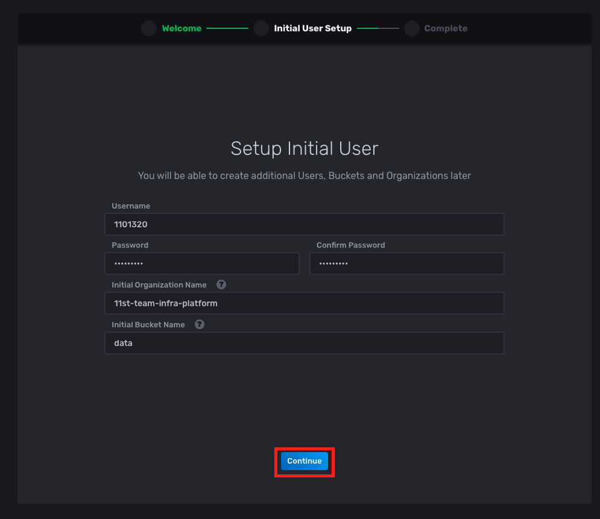
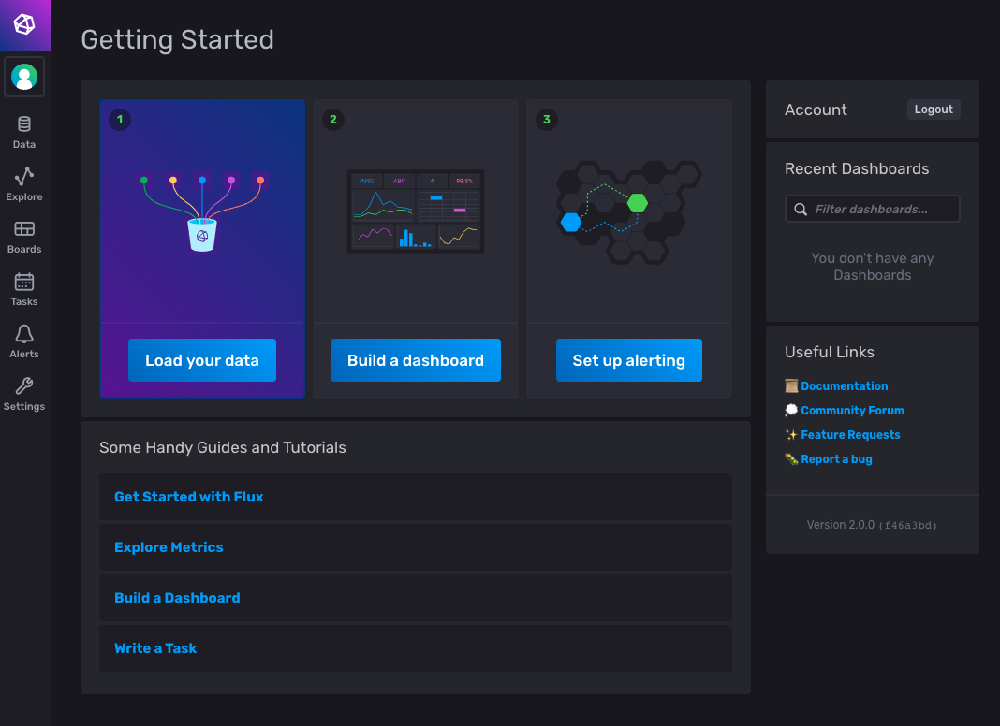
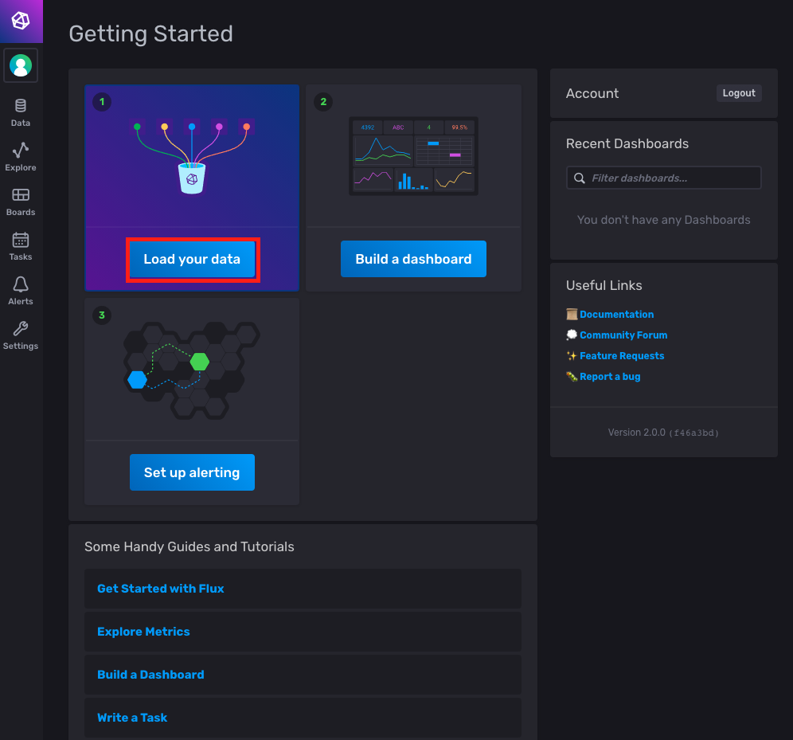
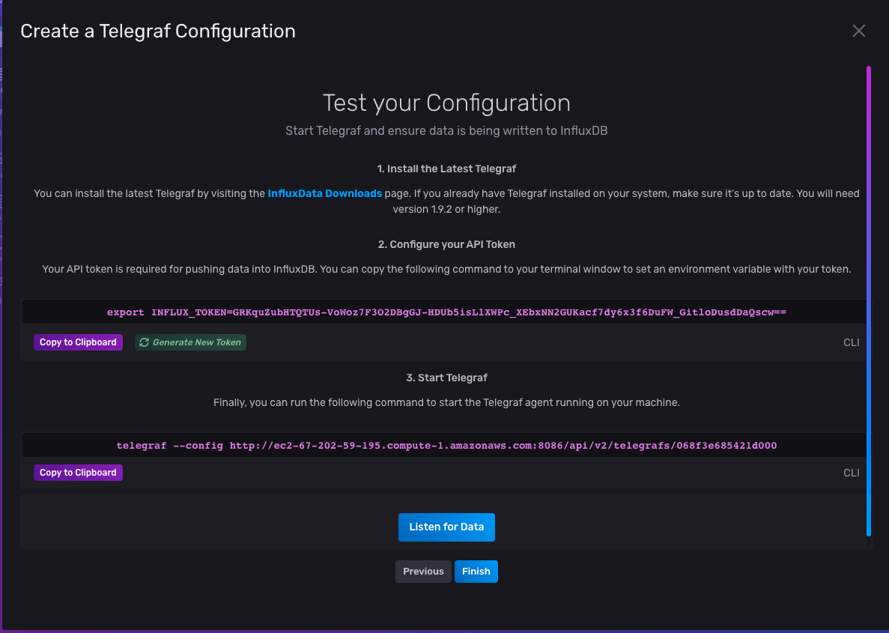
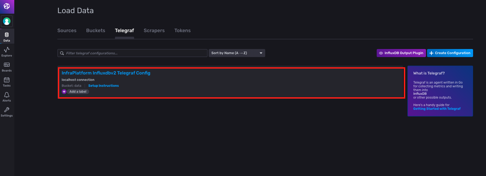

# InfluxDB 2.0 시작하기


> 이 문서는 InfluxDB 2.0를 이용하여, 모니터링 시스템을 구축하는 것에 대하여 다루고 있습니다.

## 요구 사항

이번 문서를 진행하기 위한 나의 환경은 다음과 같다.

- RedHat/CentOS 기반 운영체제
- 포트 8086에, http 접근 허용

레드햇 계열 리눅스와 `CentOS`는 이 문서가 `InfluxDB 2.0`를 포함한 모니터링 시스템을 구축하는데 도움이 될 것이다. (아마 다른 운영체제도 비슷할 것이다.) 자 시작해보자.


## InfluxDB 2.0 설치

현재 안타깝지만, `InfluxDB 2.0`을 한 번에 설치할 수 있는 패키지가 준비되어 있지 않다.(내가 아는 한...) 그래서 바이너리 파일을 직접 설치할 것이다. 먼저 서버 내에서 적당한 디렉토리로 이동한 후, 다음을 순서대로 입력한다. 

```bash
# 현재 위치
$ pwd
/home/ec2-user

# 나의 경우 "apps"이란 디렉토리에 설치 파일들을 모아둔다. 그래서 apps 디렉토리로 이동한다.
$ cd apps

# 공식 문서에서 제공되는 influxdb 2.0 바이너리 파일이 압축된 tar 파일 다운로드 경로이다.
$ wget https://dl.influxdata.com/influxdb/releases/influxdb-2.0.0-rc.3_linux_amd64.tar.gz
--2020-11-03 01:59:49--  https://dl.influxdata.com/influxdb/releases/influxdb-2.0.0-rc.3_linux_amd64.tar.gz
Resolving dl.influxdata.com (dl.influxdata.com)... 13.249.43.98, 13.249.43.124, 13.249.43.59, ...
Connecting to dl.influxdata.com (dl.influxdata.com)|13.249.43.98|:443... connected.
HTTP request sent, awaiting response... 200 OK
Length: 46135619 (44M) [application/x-gzip]
Saving to: ‘influxdb-2.0.0-rc.3_linux_amd64.tar.gz’

100%[===================================================================================================================>] 46,135,619  27.8MB/s   in 1.6s

2020-11-03 01:59:51 (27.8 MB/s) - ‘influxdb-2.0.0-rc.3_linux_amd64.tar.gz’ saved [46135619/46135619]

# 다운로드 확인
$ ll
합계 48660
-rw-rw-r-- 1 ec2-user ec2-user 49826885 10월 29 22:29 influxdb-2.0.0-rc.3_darwin_amd64.tar.gz

# 압축 파일 해제
$ tar zxvf influxdb-2.0.0-rc.3_linux_amd64.tar.gz
influxdb-2.0.0-rc.3_linux_amd64/LICENSE
influxdb-2.0.0-rc.3_linux_amd64/README.md
influxdb-2.0.0-rc.3_linux_amd64/influx
influxdb-2.0.0-rc.3_linux_amd64/influxd

# 실행 경로에 "influx", "influxd"를 옮긴다. 나의 실행 경로는 "/usr/local/bin"이다.
$ sudo cp influxdb-2.0.0-rc.3_linux_amd64/{influx,influxd} /usr/local/bin/

# influxdb 실행
$ influxd
2020-11-03T02:02:35.897826Z	info	Welcome to InfluxDB	{"log_id": "0QEyJTzG000", "version": "2.0.0-rc.3", "commit": "f46a3bd91e", "build_date": "2020-10-29T22:17:55Z"}
2020-11-03T02:02:35.902393Z	info	Resources opened	{"log_id": "0QEyJTzG000", "service": "bolt", "path": "/home/ec2-user/.influxdbv2/influxd.bolt"}
2020-11-03T02:02:35.903899Z	info	Migration "initial migration" started (up)	{"log_id": "0QEyJTzG000", "service": "migrations"}
2020-11-03T02:02:35.964158Z	info	Migration "initial migration" completed (up)	{"log_id": "0QEyJTzG000", "service": "migrations"}
...
```

그 후 브라우저에서, 현재 머신의 IP 주소 + 8086 포트에 접속하면, 다음 화면을 확인할 수 있다. 나의 경우 `AWS Linux AMI`을 이용하기 때문에, 해당 경로로 접속하면 다음 화면을 확인할 수 있다.


## InfluxDB 2.0 설정

바로 공식 문서대로 UI기반으로 `InfluxDB 2.0`을 세팅할 수 있다. 그 전에 조금 더 편하게 운영하기 위해서, 서비스 형태로 `InfluxDB 2.0`을 구동시켜보자. 먼저, 터미널에서 실행하고 있는 `influxd`를 종료한다.

리눅스의 경우, `systemctl`로 `.service`파일을 서비스로 시작/종료/상태 확인이 가능하다. `systemctl` 명령어는 `/lib/sytemd/system` 디렉토리 밑에 `.service` 파일들을 참조하기 때문에  `influxdb2.service` 파일을 "sudo" 권한으로 해당 디렉토리 경로에 생성한다. 

```bash
$ sudo vi /lib/systemd/system/influxdb2.service
```

그럼 vi 터미널이 열리는데, 다음을 입력한다.

```service
[[Unit]
Description=InfluxDB 2.0 service file.

[Service]
ExecStart=/usr/local/bin/influxd
Restart=on-failure
StartLimitBurst=2
StartLimitInterval=30

[Install]
WantedBy=multi-user.target
```

`:wq` 명령어를 눌러 저장하고 종료한다. 이제 터미널에 다음을 입력한다.

```bash
# 서비스 실행
$ sudo systemctl start influxdb2

# 서비스 상태 확인
$ sudo systemctl status influxdb2
● influxdb2.service - InfluxDB 2.0 service file.
   Loaded: loaded (/usr/lib/systemd/system/influxdb2.service; disabled; vendor preset: disabled)
   Active: active (running) since 화 2020-11-03 02:39:54 UTC; 10s ago
 Main PID: 15094 (influxd)
   CGroup: /system.slice/influxdb2.service
           └─15094 /usr/local/bin/influxd

...
```

역시 같은 경로로 접속하면 다음 화면을 확인할 수 있다.


이제 "Get Started"를 눌러서 세팅을 진행해보자.



그럼 위의 화면이 뜨는데, 입력 창에 값을 적적하게 넣어준 후 "Continue"를 눌러보자.


이제 "Continue Later"를 클릭한다.



그럼 다음 화면이 뜬다. 이렇게 해서 `InfluxDB 2.0` 설정이 끝났다. 

 
## Telegraf 설치

이제 머신에 `Telegraf`를 설치하여 시스템 메트릭을 수집하여 `InfluxDB 2.0`에 저장해 볼 것이다. 먼저 `Telegraf`를 설치한다. 이번엔 패키지 매니저 기반으로 설치한다. 이 때, 패키지 매니저가 최신 `telegraf`를 설치할 수 있도록, `/etc/yum.repos.d/` 밑에 `influxdb.repo`를 만들어주어야 한다. 터미널에 다음을 입력한다.

```bash
# /etc/yum.repos.d/ 밑에 influxdb.repo 생성
$ cat <<EOF | sudo tee /etc/yum.repos.d/influxdb.repo
[influxdb]
name = InfluxDB Repository - RHEL $releasever
baseurl = https://repos.influxdata.com/rhel/7/\$basearch/stable
enabled = 1
gpgcheck = 1
gpgkey = https://repos.influxdata.com/influxdb.key
retries = 7
skip_if_unavailable = 1
keepcache = 0
timeout = 5.0
EOF

# telegraf 설치
$ sudo yum install telegraf
...

# telegraf 실행
$ sudo systemctl start telegraf
$ sudo systemctl status telegraf
● telegraf.service - The plugin-driven server agent for reporting metrics into InfluxDB
   Loaded: loaded (/usr/lib/systemd/system/telegraf.service; enabled; vendor preset: disabled)
   Active: active (running) since 화 2020-11-03 06:51:45 UTC; 7s ago
     Docs: https://github.com/influxdata/telegraf
 Main PID: 16687 (telegraf)
   CGroup: /system.slice/telegraf.service
           └─16687 /usr/bin/telegraf -config /etc/telegraf/telegraf.conf -config-directory /etc/telegraf/telegraf.d
...
```


## InfluxDB 2.0 - Telegraf 연동

이제 `InfluxDB 2.0`과 `Telegraf`를 연동시켜보자. `InfluxDB 2.0`을 웹 브라우저를 통해서 접속한다. 



로그인하게 되면, 첫 화면인데, "Load your data"를 클릭한다.


그 다음, "Telegraf"를 클릭한다.


위의 화면에서, "Create Configuration"을 클릭한다.


그럼 위의 모달 창이 뜬다. 그러면, "System"을 클릭한다. 그럼 하단에 "Continue" 버튼이 활성화된다. 이 버튼을 클릭한다.


위의 화면에서 입력 창에 적절한 값을 주고 "Create and Verify" 버튼을 클릭한다.



이제 하단에 "Finish" 버튼을 누른다. 이제 "Data" > "Tokens"로 이동해보면, `Telegraf`용 토큰이 생긴 것을 확인할 수 있다.



이제 "sudo"권한으로 `/etc/telegraf/telegraf.conf`를 다음과 같이 수정한다.


```conf
# Configuration for telegraf agent
[agent]
  ## Default data collection interval for all inputs
  interval = "10s"
  ## Rounds collection interval to 'interval'
  ## ie, if interval="10s" then always collect on :00, :10, :20, etc.
  round_interval = true

  ## Telegraf will send metrics to outputs in batches of at most
  ## metric_batch_size metrics.
  ## This controls the size of writes that Telegraf sends to output plugins.
  metric_batch_size = 1000

  ## For failed writes, telegraf will cache metric_buffer_limit metrics for each
  ## output, and will flush this buffer on a successful write. Oldest metrics
  ## are dropped first when this buffer fills.
  ## This buffer only fills when writes fail to output plugin(s).
  metric_buffer_limit = 10000

  ## Collection jitter is used to jitter the collection by a random amount.
  ## Each plugin will sleep for a random time within jitter before collecting.
  ## This can be used to avoid many plugins querying things like sysfs at the
  ## same time, which can have a measurable effect on the system.
  collection_jitter = "0s"

  ## Default flushing interval for all outputs. Maximum flush_interval will be
  ## flush_interval + flush_jitter
  flush_interval = "10s"
  ## Jitter the flush interval by a random amount. This is primarily to avoid
  ## large write spikes for users running a large number of telegraf instances.
  ## ie, a jitter of 5s and interval 10s means flushes will happen every 10-15s
  flush_jitter = "0s"

  ## By default or when set to "0s", precision will be set to the same
  ## timestamp order as the collection interval, with the maximum being 1s.
  ##   ie, when interval = "10s", precision will be "1s"
  ##       when interval = "250ms", precision will be "1ms"
  ## Precision will NOT be used for service inputs. It is up to each individual
  ## service input to set the timestamp at the appropriate precision.
  ## Valid time units are "ns", "us" (or "µs"), "ms", "s".
  precision = ""

  ## Logging configuration:
  ## Run telegraf with debug log messages.
  debug = false
  ## Run telegraf in quiet mode (error log messages only).
  quiet = false
  ## Specify the log file name. The empty string means to log to stderr.
  logfile = ""

  ## Override default hostname, if empty use os.Hostname()
  hostname = ""
  ## If set to true, do no set the "host" tag in the telegraf agent.
  omit_hostname = false
[[outputs.influxdb_v2]]	
  ## The URLs of the InfluxDB cluster nodes.
  ##
  ## Multiple URLs can be specified for a single cluster, only ONE of the
  ## urls will be written to each interval.
  ## urls exp: http://127.0.0.1:8086
  urls = ["http://localhost:8086"]

  ## Token for authentication.
  # 이것은 "Data > TOKENS"에서 확인했던 토큰으로 업데이트 해준다.
  token = "$INFLUX_TOKEN"

  ## Organization is the name of the organization you wish to write to; must exist.
  organization = "11st-team-infra-platform"

  ## Destination bucket to write into.
  bucket = "data"
[[inputs.cpu]]
  ## Whether to report per-cpu stats or not
  percpu = true
  ## Whether to report total system cpu stats or not
  totalcpu = true
  ## If true, collect raw CPU time metrics.
  collect_cpu_time = false
  ## If true, compute and report the sum of all non-idle CPU states.
  report_active = false
[[inputs.disk]]
  ## By default stats will be gathered for all mount points.
  ## Set mount_points will restrict the stats to only the specified mount points.
  # mount_points = ["/"]
  ## Ignore mount points by filesystem type.
  ignore_fs = ["tmpfs", "devtmpfs", "devfs", "overlay", "aufs", "squashfs"]
[[inputs.diskio]]
[[inputs.mem]]
[[inputs.net]]
[[inputs.processes]]
[[inputs.swap]]
[[inputs.system]]
```

> 참고!
> 
> 위 설정은, "Data" > "Telegraf"에서 확인할 수 있습니다. 

그 후 `Telegraf`를 재실행하면 된다.

```bash
$ sudo systemctl restart telegraf
```

이제 몇 초 후 웹 페이지에서 "Boards" > "System"를 누른다.


다음 대시보드가 보이면 성공이다.


## 참고

- [InfluxDB 2.0 공식 문서 - Get started with InfluxDB](https://docs.influxdata.com/influxdb/v2.0/get-started/)
- [InfluxDB 2.0 공식 문서 - Automatically configure Telegraf](https://docs.influxdata.com/influxdb/v2.0/write-data/no-code/use-telegraf/auto-config/)
- [InfluxDB 1.7, 2.0 설치 방법](https://devconnected.com/how-to-install-influxdb-on-ubuntu-debian-in-2019/)
- [AWS Amazon Linux에 Telegraf 설치 시, 패키지 매니저 업데이트 방법](http://blog.naver.com/PostView.nhn?blogId=jsf3rd&logNo=220719782584)