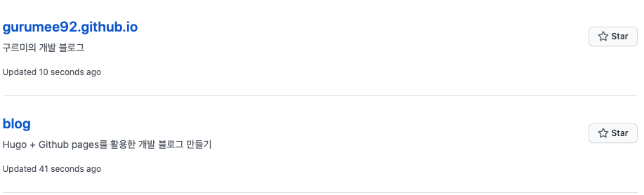
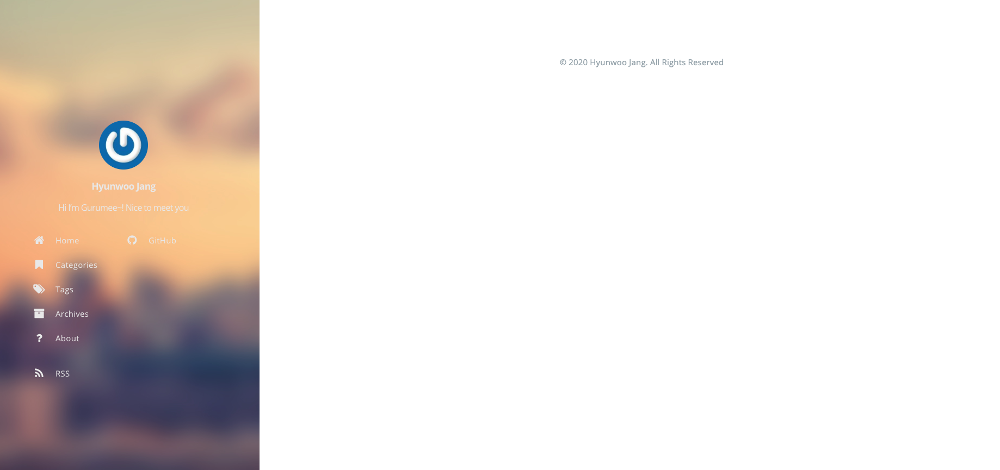

# Hugo + Github으로 개인 블로그 만들기

## 개요 

개인적으로, 원래 블로그 플랫폼으로 `Tistory`를 이용했었다. 언젠가 사람들이 `Github` 페이지로 개발 블로그를 만드는 것을 보고 멋있다고 생각한 것 같다. 올해 어떤 계기로 티스토리 블로그를 닫았는데, 새로운 마음으로 `Github` 페이지룰 이용하여, 개발 블로그를 만들 생각이다.

보통 `Github` 페이지로 개발 블로그를 만들 때 사용하는 것은 `Jekyll`, `Hexo`, `Hugo` 이 3가지 중 하나를 사용한다. 이들은 `Static Site Generator`로써 직역하면 정적 페이지 생성기이다. 웹 페이지는 크게 `정적 페이지`와 `동적 페이지`로 나눌 수 있다. `동적 페이지`란, 클라이언트 액션에 반응해서 웹 서버, DB 등 여러 컴포넌트들이 상호 작용하여 HTML 페이지를 동적으로 만들어주는 페이지를 말한다. 뭐 개발자라면, `Java` 진영에서는 `Spring MVC`로 만든 웹 서비스라고 생각하면 편하다. 반면, `정적 페이지`는 HTML/CSS/JS를 미리 올려서 서버가 바뀌지 않는 HTML 페이지를 보여주는 것을 말한다. 

블로그를 방문하는 유저 입장에서는 모든 컨텐츠들이 언제나 `Read Only`이다. 즉 상호 작용하는 건이 별로 없다는 뜻이다. 그래서 정적 페이지 생성기를 이용해, 개발 블로그를 만들 것이다. 그 중 `Hugo`를 사용한다. `Jekyll`이 참고할 수 있는 문서량이 제일 많지만, 페이지를 많이 올릴수록 빌드 속도가 매우 저하된다는 소문이 있다. 반면 `Hugo`는 굉장히 빠르다고 한다. 그리고 `Golang`을 이용해서 만들었다는게 참 친근하게 다가왔다. 이제 잡소리는 그만하고 바로 시작하자.


## Hugo 설치

준비물은 다음과 같다.

* Mac - Windows 사용자들은 Hugo 설치 방법을 따로 찾길 바란다. 그리고 `HomeBrew`가 설치 되어 있어야 한다. 설치가 되지 않았다면, [이 곳](https://brew.sh/index_ko)을 참조하자.
* Github ID - 회원가입이 안되어 있다면, [이 곳](https://github.com/)으로 가서 회원가입하자.
* Golang - Hugo는 Golang으로 만들어져 있다. Golang을 설치해야 한다. [이 곳](https://golang.org/)을 참고하자.

터미널에 다음을 입력한다.

```bash
# hugo 설치
$ brew install hugo
```

설치가 완료되면, 다음을 터미널에 입력해보자. 

```bash
# hugo 버전 확인
$ hugo version
# 다음이 출력되면 정상적으로 설치된 것이다.
Hugo Static Site Generator v0.74.3/extended darwin/amd64 BuildDate: unknown
```


## Github 레포지토리 2개 파기

깃헙 레포지토리를 2개 파야 한다. 둘 다 아무렇게 지어도 상관은 없지만, 잘 모르겠다면, 다음처럼 만들어두자.

* `blog`
* `<USERNAME>.github.io`

다음과 같이 말이다.




## Hugo로 프로젝트 만들기

먼저, 프로젝트를 만들어야 한다. 적당한 위치에서 다음을 입력한다.

```bash
# 현재 위치 확인
$ pwd
# 현재 경로
/Users/gurumee/Workspaces

# hugo 프로젝트 생성
$ hugo new site blog
# 생성 완료되면 출력 문구
Congratulations! Your new Hugo site is created in /Users/gurumee/Workspaces/blog.

Just a few more steps and you're ready to go:

1. Download a theme into the same-named folder.
   Choose a theme from https://themes.gohugo.io/ or
   create your own with the "hugo new theme <THEMENAME>" command.
2. Perhaps you want to add some content. You can add single files
   with "hugo new <SECTIONNAME>/<FILENAME>.<FORMAT>".
3. Start the built-in live server via "hugo server".

Visit https://gohugo.io/ for quickstart guide and full documentation.
```

만들어진 프로젝트 구조는 다음과 같다.

```
├── archetypes
│   └── default.md
├── config.toml
├── content
├── data
├── layouts
├── static
└── themes
```

이제, 테마를 설정해야 한다. 테마는 자신이 만들 수도 있고, 남이 만든 것을 이용할 수 있다. 나는 남이 만든 것을 이용한다. [이 곳](https://themes.gohugo.io/)에서 공개된 테마를 설치할 수 있다. 내가 설치한 테마는 [이 곳](https://themes.gohugo.io/hugo-tranquilpeak-theme/)에서 확인할 수 있다. 보통 `Downloads`를 눌러보면 해당 `Github` 페이지로 이동되는데, 설치할 수 있는 방법이 적혀져 있다.

나의 경우는 `Hugo` 공식 문서를 참고해서, 설치하였다. 자 따라해보자. 프로젝트 루트에서 터미널을 열고 다음을 입력한다. 

```bash
$ pwd
# 프로젝트 루트 경로
/Users/gurumee/Workspaces/blog

# git submodule add https://github.com/<theme 경로>.git themes/<theme 이름>
$ git submodule add https://github.com/kakawait/hugo-tranquilpeak-theme.git themes/hugo-tranquilpeak-theme
```

그럼 `blog/themes` 디렉토리의 구조는 다음과 같다.

```
└── hugo-tranquilpeak-theme
    ├── archetypes
    ├── docs
    │   └── img
    ├── exampleSite
    │   ├── content
    │   │   └── post
    │   └── static
    │       └── img
    ├── i18n
    ├── images
    ├── layouts
    │   ├── _default
    │   ├── partials
    │   │   ├── internal
    │   │   └── post
    │   ├── shortcodes
    │   └── taxonomy
    ├── src
    │   ├── images
    │   ├── js
    │   └── scss
    │       ├── base
    │       ├── components
    │       ├── layouts
    │       ├── pages
    │       ├── themes
    │       └── utils
    │           └── mixins
    ├── static
    │   ├── css
    │   ├── images
    │   └── js
    ├── tasks
    │   ├── config
    │   └── register
    ├─ theme.toml
    ├─ ...
```

여기서 `blog/themes/hugo-tranquilpeak-theme/exampleSite/config.toml`을 복사해서 `blog/config.toml`에 옮겨 놓자. 그 후 자신에게 맞게 커스텀하면 된다. 이제 터미널에 다음을 입력해보자.

```bash
# 로컬 서버 실행
$ hugo server
                   | EN-US  
-------------------+--------
  Pages            |     9  
  Paginator pages  |     0  
  Non-page files   |     0  
  Static files     |     4  
  Processed images |     0  
  Aliases          |     1  
  Sitemaps         |     1  
  Cleaned          |     0  

Built in 7 ms
Watching for changes in /Users/gurumee/Workspaces/blog/{archetypes,content,data,layouts,static,themes}
Watching for config changes in /Users/gurumee/Workspaces/blog/config.toml
Environment: "development"
Serving pages from memory
Running in Fast Render Mode. For full rebuilds on change: hugo server --disableFastRender
Web Server is available at http://localhost:1313/ (bind address 127.0.0.1)
Press Ctrl+C to stop
```

그 후, "localhost:1313"에 들어가면 다음과 같은 화면이 뜰 것이다.




## Git 레포지토리 연결 및 배포 자동화

## 포스트 작성하기

## Utterences (Github 댓글 위젯) 추가하기


## 참고

* [Hugo 공식 홈페이지 Quick Start](https://gohugo.io/getting-started/quick-start/)
* [Hugo로 Github.io 블로그 만들기](https://github.com/Integerous/Integerous.github.io)


