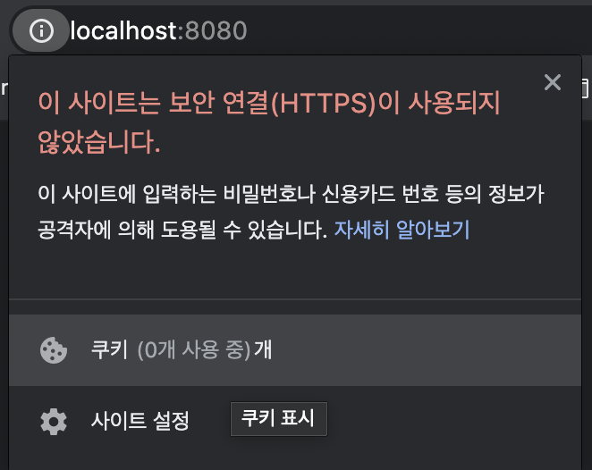
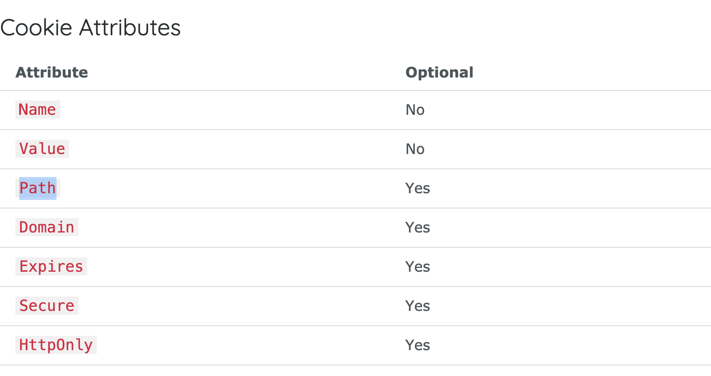

# 7월 30일 작업 : 소셜 로그인 기능

## 개요

29일에 이어서, 소셜 로그인 기능을 작성했다.


## 어제 작업 요약

어제는 원인까지 알아보았다. 어제 밝힌 원인으로는 다음이 있다.

1. 구글/네이버 애플리케이션 등록 시, 한 앱만 접근이 가능하다. 따라서 하나에 한 개씩 할당해준다.
2. 리다이렉트되면, 쿠키를 못 읽고 있다. 소셜 프로바이더 문제일까? 


## 오늘 작업

오늘은 OAuth 2.0 로그인 기능을 완료하였다. 처음에는 쿠키가 아닌 세션으로 진행하면 가능할 것 처럼 보였으나 둘 다 안되었다. 하도 이상해서 브라우저의 쿠키를 뒤져봤는데, Application 탭에는 보이지 않았는데, 검색 창 좌측에 "!" 표시를 눌러보니 쿠키들을 확인할 수 있었다.



즉, 소셜 프로바이더 문제는 아닌 것이었다. 그렇다면 왜 안되나? Echo 프레임워크에 예제를 한 번 실행해보았다. 나의 소스 코드는 이렇게 변했다.

devilog/handler/routes.go
```go
// ...
	e.GET("/oauth2/authorization/naver", h.NaverLogin)
	e.GET("/login/oauth2/code/naver", h.NaverCallback)

	e.GET("/test-write", func (c echo.Context) error {
		cookie := new(http.Cookie)
		cookie.Name = "username"
		cookie.Value = "jon"
		cookie.Expires = time.Now().Add(24 * time.Hour)
		c.SetCookie(cookie)
		return c.Redirect(http.StatusTemporaryRedirect, "/test-read")
	})
	e.GET("/test-read", func (c echo.Context) error {
		cookie, err := c.Cookie("username")
		if err != nil {
			return err
		}
		log.Println(cookie.Name)
		log.Println(cookie.Value)
		return c.String(http.StatusOK, "read a cookie")
	})	
}
```

근데 왠걸? "test-write" 접속하면 "test-read"로 리다이렉트되어, 쿠키 값이 존재하는 것 아니겠는가? 다른 것 URL Path가 다른 것 뿐인데... 하면서 혹시? 공식 문서를 더 뒤져봤다.



"Path"가 있다. 왠지 디폴트 값이 "/"로 되어 있는 것 같아서, 콜백 함수의 경로를 적어주었다. 이렇게

devilog/handler/user_api.go
```go
// GoogleLogin is
func (h *Handler) GoogleLogin(c echo.Context) error {
	state := generateOauthState()
	cookie := new(http.Cookie)
	cookie.Name = "state"
	cookie.Value = state
	cookie.Expires = time.Now().Add(1 * 24 * time.Hour)
	// 이 부분
	cookie.Path = "/login/oauth2/code/google"
	c.SetCookie(cookie)
	url := h.config.GoogleOAuth.AuthCodeURL(state)
	return c.Redirect(http.StatusTemporaryRedirect, url)
}

// GoogleCallback is "/login/oauth2/code/google" 실행되는 함수이다.
func (h *Handler) GoogleCallback(c echo.Context) error {
	cookie, err := c.Cookie("state")

	if err != nil {
		return err
	}

	if c.FormValue("state") != cookie.Value {
		log.Printf("invalid google oauth state cookie:%s state:%s\n", cookie.Value, c.FormValue("state"))
		return c.Redirect(http.StatusTemporaryRedirect, "/error")
	}

	return c.Redirect(http.StatusTemporaryRedirect, "/")
}
```

이렇게 하니까 문제 없이 통과되었다. 이제 콜백 함수에서, 유저 정보를 뺴내서 유저를 만들면 될 것 같다.


## 내일 작업

내일은 OAuth 로그인이 성공했으니까, 유저 모델, 스토어를 추가한 후 권한 처리를 해주면 될 것 같다. 프로젝트의 끝이 보인다!