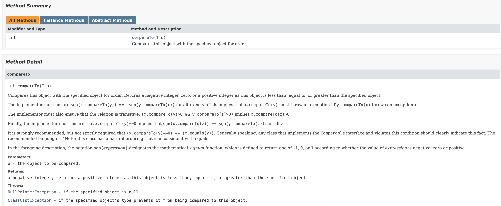

# 모든 객체의 공통 메소드


> 책 "이펙티브 자바 3판"을 공부하면서 정리한 문서입니다.

## 목차

- [모든 객체의 공통 메소드](#모든-객체의-공통-메소드)
  - [목차](#목차)
  - [equals는 일반 규약을 지켜 재정의하라](#equals는-일반-규약을-지켜-재정의하라)
  - [equals를 재정의하려거든 hashCode도 재정의하라](#equals를-재정의하려거든-hashcode도-재정의하라)
  - [toString은 항상 재정의하라](#tostring은-항상-재정의하라)
  - [clone 재정의는 주의해서 진행하라](#clone-재정의는-주의해서-진행하라)
  - [Comparable을 구현할지 고려하라](#comparable을-구현할지-고려하라)

이번 장에서는 Java 클래스들의 최상위 클래스 `Object`의 메서드들과 비교 인터페인스인 `Comparable`의 compareTo 메서드를 언제, 어떻게 구현하는지에 대해 공부한다.

`Object` 클래스 의 명세는 다음과 같다.


이 중 우리가 공부할 메서드는 다음과 같다.

* equals
* hashcode
* toString
* clone

`Comparable` 인터페이스는 `Object` 클래스의 공통 메소드들과 성격이 유사하다. 따라서, 이 장에서 같이 공부한다. 명세는 다음과 같다.




## equals는 일반 규약을 지켜 재정의하라

책에서는 다음 상황 중 하나라도 부합한다면, `equals` 메소드의 재정의를 하지 않는 것을 권장한다.

1. 각 인스턴스가 본질적으로 고유하다. 예) Thread, 값이 아닌 동작하는 객체를 표현하는 클래스일 때.
2. 인스턴스의 논리적 동치성을 검사할 일이 없다. 예외) java.util.regex.Pattern
3. 상위 클래스에서 재정의한 equals가 하위 클래스에도 딱 들어맞는다. ex) List, Set 등 구현체들, 이들은 AbstractList, AbstractSet 등의 equals를 쓴다.
4. 클래스가 private, pacakge-private이고 equals를 호출할 일이 없다. 

이러한 경우 상속 시, `equals` 메소드 재정의를 막는 방법은 다음과 같다.

```java
public class Example {
    @Override
    public boolean equals(Object o) {
        throw new AssertionError();
    }
}
```

그럼 언제 이를 재정의해야할까? 바로 "값 클래스"처럼 논리적 동치성을 확인해야 할 때 재정의한다. 예를 들어 `Integer`, `String` 처럼 값을 나타내는 클래스들을 상속할 때이다.

예외) 
1. 값이 같은 인스턴스가 2개 이상 발생하지 않음을 보장하는, 인스턴스 통제 클래스
2. `Enum` 클래스

다음은 `Object` 클래스의 명세에 적힌 규약이다.

`equals` 메소드는 "동치" 관계를 구현하며, 다음을 만족한다.

* 반사성 : x.equals(x) == true
* 대칭성 : x.equals(y) == y.eqauls(x)
* 추이성 : x.equals(y) == true, y.equals(z) = true, then x.equals(z) == true
* 일관성 : x.equals(y)는 항상 같은 값
* Not NULL : x.equals(null) == false

한 번 예를 들어보자. 다음 코드의 문제는 무엇일까?

```java
public final class CaseInsensitiveString {
    private final String s;

    public CaseInsensitiveString(String s) {
        this.s = Objects.requireNonNull(s);
    }

    @Override
    public boolean equals(Object o) {
        if (o instanceof CaseInsensitiveString) {
            return s.equalsIgnoreCase(((CaseInsensitiveString)o).s);
        }
        if (o instanceof String) {
            return s.equalsIgnoreCase((String) o);
        }
        return false;
    }
}
```

이 경우, 대칭성에 대해 만족하지 않는다. 왜냐하면 다음의 예를 살펴보자.

```java
public class Item10Test {
    // ...
    @Test
    @DisplayName("동치성 테스트 - 대칭성")
    public void test02() {
        CaseInsensitiveString cis = new CaseInsensitiveString("Polish");
        String s = "polish";
        assertTrue(cis.equals(s));
        assertFalse(s.equals(cis));
    }
}
```

개발자는 `String` 클래스와 `CaseInsensitiveString` 클래스의 논리적 동치성을 만족하길 원했지만, 이렇게 짜면 `String` 클래스는 `CaseInsensitiveString` 클래스의 존재를 모르기 때문에, `String.equals(CaseInsensitiveString)` 는 항상 false의 결과를 얻는다. 동치성을 판단할 때는 **그 클래스간 동치성**만을 판단하는 것이 권장된다. 즉 `CaseInsensitiveString` 클래스의 `eqauls` 메서드는 다음과 같이 변경된다.

```java
public final class CaseInsensitiveString {
    private final String s;

    public CaseInsensitiveString(String s) {
        this.s = Objects.requireNonNull(s);
    }

    @Override
    public boolean equals(Object o) {
        if (o == null) {
            return false;
        }

        if (o == this) {
            return true;
        }

        if (!(o instanceof CaseInsensitiveString)) {
            return false;
        }

        CaseInsensitiveString cis = (CaseInsensitiveString) o;
        return cis.s.equalsIgnoreCase(this.s);
    }
}
```

테스트의 예도 다음과 같이 변경된다.

```java
public class Item10Test {
    // ...

    @Test
    @DisplayName("동치성 테스트 - 대칭성")
    public void test02() {
        CaseInsensitiveString cis1 = new CaseInsensitiveString("Polish");
        CaseInsensitiveString cis2 = new CaseInsensitiveString("polish");
        assertEquals(cis1, cis2);
        assertEquals(cis2, cis1);
    }
}
```

테스트 코드를 보면 무사히 통과하는 것을 확인할 수 있다. 5가지 규약에 대한 테스트 코드는 다음과 같다.

```java
public class Item10Test {
    @Test
    @DisplayName("동치성 테스트 - 반사성")
    public void test01() {
        CaseInsensitiveString cis = new CaseInsensitiveString("test");
        // cis.equas(cis) == true
        assertEquals(cis, cis);
    }

    @Test
    @DisplayName("동치성 테스트 - 대칭성")
    public void test02() {
        CaseInsensitiveString cis1 = new CaseInsensitiveString("Polish");
        CaseInsensitiveString cis2 = new CaseInsensitiveString("polish");
        // cis1.equals(cis2) then, cis2.equals(cis1)
        assertEquals(cis1, cis2);
        assertEquals(cis2, cis1);
    }

    @Test
    @DisplayName("동치성 테스트 - 추이성")
    public void test03() {
        CaseInsensitiveString cis1 = new CaseInsensitiveString("Polish");
        CaseInsensitiveString cis2 = new CaseInsensitiveString("polish");
        CaseInsensitiveString cis3 = new CaseInsensitiveString("poLIsh");
        // cis1.equals(cis2), cis2.equals(cis3), then cis1.equals(cis3)
        assertEquals(cis1, cis2);
        assertEquals(cis2, cis3);
        assertEquals(cis1, cis3);
    }

    @Test
    @DisplayName("동치성 테스트 - 일관성")
    public void test04() {
        CaseInsensitiveString cis1 = new CaseInsensitiveString("Polish");
        CaseInsensitiveString cis2 = new CaseInsensitiveString("polish");
        // 매번 같은 결과를 나타낸다.
        for (int i=0; i<100; i++) {
            assertEquals(cis1, cis2);
        }
    }

    @Test
    @DisplayName("동치성 테스트 - Not NULL")
    public void test05() {
        CaseInsensitiveString cis = new CaseInsensitiveString("Polish");
        // cis.equals(null) == fasle 
        assertNotEquals(null, cis);
    }
}
```

이렇게 equals 메소드를 재정의한 클래스의 필드/메소드로는 부족해서 이 클래스를 상속해야 할 때가 있다. 이 경우, 상속 보다는 "컴포지션"을 이용하는 것이 좋다. 왜냐하면, 상속의 경우, 결국 equals 규약을 깨거나 혹은 객체 지향적 추상화의 이점을 포기해야 하기 때문이다. equals를 구현하는 단계는 다음과 같다.

1. == 연산자를 사용하여, 입력이 자기 자신의 참조인지 확인한다.
2. instanceof 연산자로 입력이 올바른 타입인지 확인한다.
3. 입력을 올바른 타입으로 형변환한다.
4. 입력 객체와 자기 자신의 대응되는 핵심 필드들이 모두 일치하는지 확인한다.

우리가 구현한 CaseInsensitiveString 클래스의 equals 메소드는 이를 충실히 따르고 있다.

```java
public final class CaseInsensitiveString {
    // ...

    @Override
    public boolean equals(Object o) {
        // 1단계
        if (o == null) {
            return false;
        }

        if (o == this) {
            return true;
        }
        
        // 2단계
        if (!(o instanceof CaseInsensitiveString)) {
            return false;
        }
        // 3단계
        CaseInsensitiveString cis = (CaseInsensitiveString) o;
        // 4 단계
        return cis.s.equalsIgnoreCase(this.s);
    }
}
```


## equals를 재정의하려거든 hashCode도 재정의하라

`equals` 메소드를 재정의한 클래스는 `hashCode` 메소드 역시 반드시 재정의해야 한다. 재정의하지 않으면, `HashMap`, `HashSet` 등의 컬렉션의 원소로 사용될 때 오동작하게 된다. 다음은 `Object` 클래스의 명세에서 `hashCode` 메소드에 대한 규약이다.

* equals 비교에 사용되는 정보가 변경되지 않는다면, 애플리케이션이 실행되는 동안 그 객체의 hashCode 메소드 역시 항상 값은 값을 반환한다.
* equasl 메소드가 두 객체를 같다고 판단했을 때, hashCode 메소드 역시 같은 값을 반환한다.
* equals 메소드가 두 객체를 다르게 판단했더라도 hashCode 메소드의 값이 서로 다를 필요는 없다.

자 다음 예를 살펴보자. `hashCode` 메소드를 재정의하지 않은 `PhoneNumber` 클래스이다.

```java
public final class PhoneNumber {
    private final short areaCode, prefix, lineNum;

    public PhoneNumber(short areaCode, short prefix, short lineNum) {
        this.areaCode = areaCode;
        this.prefix = prefix;
        this.lineNum = lineNum;
    }
    
    @Override
    public boolean equals(Object o) {
        if (o == null) {
            return false;
        }

        if (o == this) {
            return true;
        }

        if (!(o instanceof PhoneNumber)) {
            return false;
        }

        PhoneNumber phoneNumber = (PhoneNumber) o;
        return phoneNumber.lineNum == this.lineNum &&
                phoneNumber.prefix == this.prefix &&
                phoneNumber.areaCode == this.areaCode;
    }
}
```

이 클래스에 대한 테스트 코드를 작성한다.

```java
public class Item11Test {
    private PhoneNumber pn1;
    private PhoneNumber pn2;

    @BeforeEach
    public void setUp() {
        short areaCode = 707;
        short prefix = 867;
        short lineNum = 5309;
        pn1 = new PhoneNumber(areaCode, prefix, lineNum);
        pn2 = new PhoneNumber(areaCode, prefix, lineNum);
    }

    @Test
    @DisplayName("동치성 테스트")
    public void test01() {
        assertEquals(pn1, pn2);
    }

    @Test
    @DisplayName("HashCode 테스트")
    public void test02() {
        HashMap<PhoneNumber, String> map = new HashMap<>();
        map.put(pn1, "제니");
        // 해시 코드를 적절하게 재정의했다면, 다음 테스트를 통과한다.
        String name = map.get(pn2);
        assertEquals("제니", name);
    }
}
```

먼저 다음과 같이 짜면, 테스트 전에 `PhoneNumber` 객체 2개를 새로 생성한다. 그 후, `test01` 메소드에서 동치성 테스트를 실행한다. 통과한다. 그러나 현재 `PhoneNumber` 클래스는 `hashCode` 메소드가 재정의하지 않았기 때문에, `HashCode` 테스트에 대해서 실패한다. 이제 `hashCode` 메소드를 재정의해보자. 

간단하게 `hashCode` 메소드를 재정의하는 방법은 다음과 같다.

1. int 변수 result를 선언한 후 값 c로 초기화한다. 이 때 c는 해당 객체의 첫번째 필드를 단계 2.1 방식으로 계산한 해시코드이다. (**핵심 필드는 equals 메소드에서 객체의 동치성을 판단을 위해 사용되는 필드들이다.**)
2. 해당 객체의 나머지 핵심 필드 f를 각각에 대해 다음 작업을 수행한다.
   1. 해당 필드 f에 대해서 해시 코드 c를 계산한다.
      1. 기본 타입 필드라면, `Type.hashCode(f)`를 수행한다. 여기서 Type은 해당 기본 타입의 박싱 클래스이다.
      2. 참조 타입 필드이면서, 이 클래스의 equals 메소드가 이 필드의 equals 메소드를 재귀적으로 호출하여 비교할 때, 이 필드의 hashCode 메소드를 재귀적으로 호출한다.
      3. 필드가 배열이라면, 핵심 원소 각각을 별도 필드처럼 다룬다. 모든 원소가 핵심 원소라면, `Arrahs.hashCode`를 사용한다.
   2. 단계 2.1에서 계산한 해시코드 c로 result를 갱신한다. 코드로는 다음과 같다.
        ```java
        result = 31 * result + c;
        ```
3. result를 반환한다. 


이 규칙에 스레드 안정성까지 고려한 코드는 다음과 같다.

```java
package ch03;

public final class PhoneNumber {
    // 이전과 동일

    private int hashCode;
    
    @Override
    public int hashCode() {
        int result = hashCode;

        if (result == 0) {
            result = Short.hashCode(areaCode);
            result = 31 * result + Short.hashCode(prefix);
            result = 31 * result + Short.hashCode(lineNum);
            hashCode = result;
        }

        return result;
    }
}
```

이제 테스트 코드를 수행하면 2개의 테스트가 정상적으로 수행되는 것을 확인할 수 있다. 중요한 점은 클라이언트에게 API를 제공할 때 **hashCode 메소드가 반환하는 값의 생성 규칙을 API에 제공하지 않는 것이다.**


## toString은 항상 재정의하라

`toString` 메소드는 객체를 기본적으로 문자열로 변환한다. 먼저 다음 테스트 코드를 작성한다.

```java
public class Item12Test {
    @Test
    @DisplayName("toString 테스트")
    public void test01() {
        short areaCode = 707;
        short prefix = 867;
        short lineNum = 5309;
        PhoneNumber pn = new PhoneNumber(areaCode, prefix, lineNum);
        System.out.println(pn);
        assertEquals("707-867-5309", pn.toString());
    }
}
```

다음 테스트 코드를 수행해보면 다음의 결과를 얻을 수 있다.

```bash
expected: <707-867-5309> but was: <ch03.PhoneNumber@adbbd>
Expected :707-867-5309
Actual   :ch03.PhoneNumber@adbbd
```

보통 `toString` 메소드를 재정의하지 않으면, 문자열 변환 시, "클래스 패스@특정 값"으로 변환된다. 이는 개발자로 하여금 이 객체의 정보가 무엇인지 판단하기 어렵게 한다. 출력 함수(System.out.println)로 디버깅할 경우 특히 더 어려움을 낳는다. 그래서 이를 재정의해주면 좋다. `toString` 메소드를 재정의한 `PhoneNumber` 클래스의 코드는 다음과 같다.

```java
public final class PhoneNumber {
    // 이전과 동일

    /**
     * PhoneNumber의 문자열 표현을 반환한다.
     * 이 문자열은 "XXX-YYY-ZZZZ" 형태의 12글자로 구성된다.
     * 각 대문자는 10진수 숫자 하나를 나타낸다. 만약, areaCode가 12라면, 012로 표현되어야 한다.
     * @return "areacode-prefix-lineNum"
     */
    @Override
    public String toString(){
        return areaCode + "-" + prefix + "-" + lineNum;
    }
}
```

이제 테스트 코드를 수행하면, 테스트가 정상적으로 통과됨을 볼 수 있다. 이 떄 주의할 점은 위 코드처럼, 문자열 포맷 명시 혹은, 개발자의 의도를 명확히 밝혀야 한다.


## clone 재정의는 주의해서 진행하라

책에서는 새로운 인터페이스를 만들 때, `Cloneable` 인터페이스를 확장해서는 안되며, 새로운 클래스도 이를 구현해서는 안된다고 적혀 있다. final 클래스의 경우엔, 사용해도 되지만 성능 최적화 관점에서 검토 후에 사용하는 것이 좋다고 한다. 기본 원칙은 "**복제 기능은 생성자와 팩토리 메소드를 이용하는 것이 최고**"라는 것이다. 그럼에도 불구하고 사용해야 한다면, 다음을 살펴보자.

`Object` 클래스의 명세에서 `clone` 메소드에 대한 규약은 다음과 같다.

* x.clone() != x
* x.clone.getClass() == x.getClass()
* x.clone().equals(x)

여기서 2번째, 3번째 규약은 항상 참이 아니어도 된다는 점을 기억하자. clone 시 가장 중요한 점은, 복제한 클래스와 가변 상태를 공유하면 안된다는 점이다. 다음 클래스를 살펴보자.

```java
public class Stack implements Cloneable {
    private LinkedList<Object> elements;

    public Stack() {
        this.elements = new LinkedList<>();
    }

    public void push(Object e) {
        elements.add(e);
    }

    public Object pop() {
        if (elements.size() <= 0) {
            throw new EmptyStackException();
        }

        Object result = elements.removeLast();
        return result;
    }

    public int getSize() {
        return elements.size();
    }

    @Override
    public Stack clone() {
        try {
            Stack result = (Stack) super.clone();
            return result;
        } catch (CloneNotSupportedException e) {
            throw new AssertionError();
        }
    }
}
```

위 코드는 `LinkedList` 클래스를 이용해서 만든 `Stack` 클래스의 코드이다. 이제 다음의 테스트 코드를 작성하자.

```java
public class Item13Test {
    @Test
    @DisplayName("clone 테스트 - 가변 상태 공유하면 안된다.")
    public void test01() {
        Stack stack = new Stack();
        stack.push(1);
        stack.push(2);

        Stack copy = stack.clone();
        copy.pop();

        assertEquals(2, stack.getSize());
        assertEquals(1, copy.getSize());
    }
}
```

이 경우 스택을 생성하고 클론 시, 그 필드인, 링크드 리스트까지 클론하길 원하는 것이다. 그러나, 테스트 코드를 수행하면 실패한다. 왜냐하면 스택의 클론이 수행될 때 링크드 클래스는 클론되지 않고 그 참조만이 클론된다. 따라서 `stack`, `copy는` 같은 링크드 리스트의 참조를 바라보기 때문에, 하나에서 추가/삭제가 이루어지면 둘 다 추가/삭제가 이루어진 것으로 보인다. 이런 참조 클래스를 필드를 가질 때 그 필드 역시 클론을 재귀적으로 호출해주어야 한다. 이렇게 말이다.

```java
public class Stack implements Cloneable {
    // 이전과 동일

    @Override
    public Stack clone() {
        try {
            Stack result = (Stack) super.clone();
            result.elements = (LinkedList<Object>) elements.clone();
            return result;
        } catch (CloneNotSupportedException e) {
            throw new AssertionError();
        }
    }
}
```

이렇게 코드를 고친 후, 테스트 코드를 실행하면 성공적으로 수행된다. 그러나 `Cloneable 아키텍처`에 따르면 **가변 객체를 참조하는 필드는 final로 선언하라**라는 규칙이 존재한다. 또한 스레드 안정성도 보장할 수 있어야 한다. 이들을 고려해서 수정한 Stack 클래스의 코드는 다음과 같다.

```java
public class Stack implements Cloneable {
    // 이전과 동일
    private final LinkedList<Object> elements; // final로 변경

    private Stack(Stack origin) {
        this.elements = new LinkedList<>();
        this.elements.addAll(origin.elements);
    }

    public static Stack getCloneInstance(Stack origin) {
        Stack clone = new Stack(origin);
        return clone;
    }


    @Override
    public Stack clone() {
        Stack result = getCloneInstance(this);
        return result;
    }
}
```

바로 복사 생성자와 팩토리 메소드를 이용해서 구현하는 것이다. 이 경우 `Cloneable 아키텍처`를 따르면서도, `clone` 메소드 역시 정상적으로 동작하는 것을 확인 할 수 있다. 또한 스레드 안정성 역시 확복할 수 있다. 각 스택의 `elements` 필드는 공유하지 않기 때문이다.

하지만 여러 모로 `clone` 메소드를 재정의하지 않는 것이 좋다. 차라리 하위 클래스에서 상속하지 못하도록 이렇게 막는 것이 훨씬 좋다.

```java
public class Example {
    @Override
    protected final Object clone() throws CloneNotSupportedException {
        throw new CloneNotSupportedException();
    }
}
```


## Comparable을 구현할지 고려하라

`Comparable` 인터페이스의 `compareTo` 메소드는 여러 모로 `Object` 클래스의 `equals` 메소드와 비슷화다. 무엇이 다를까? `compareTo` 메소드는 단순 동치성 비교와 더불어, 순서까지 비교할 수 있으며 제네릭한 성질을 더 가지고 있다. 즉 `Comparable` 인터페이스를 구현했다는 것은 클래스의 인스턴스들이 자연적인 순서가 있음을 의미한다.

`compareTo` 메소드의 규약은 다음과 같다.

1. 이 객체가 주어진 객체보다 작으면 음수를 반환한다.
2. 이 객제가 주어진 객체와 같으면 0을 반환한다. 
3. 이 객체가 주어진 객체보다 크면 양수를 반환한다. 
4. 이 객체와 주어진 객체와 비교할 수 없으면 `ClassCastException` 예외를 던진다.

이제 `CaseInsensitiveString` 클래스의 인스턴스를 비교할 수 있도록 만들어보자. 클래스를 다음과 같이 변경한다.


```java
public final class CaseInsensitiveString implements Comparable<CaseInsensitiveString>{
    // 이전과 동일

    @Override
    public int compareTo(CaseInsensitiveString cis) {
        return String.CASE_INSENSITIVE_ORDER.compare(s, cis.s);
    }
}
```

테스트 코드를 만들어보자. 

```java
public class Item14Test {
    @Test
    @DisplayName("CaseInsensitiveString compare test")
    public void test01() {
        CaseInsensitiveString cis1 = new CaseInsensitiveString("test01");
        CaseInsensitiveString cis2 = new CaseInsensitiveString("test05");
        assertTrue(0 > cis1.compareTo(cis2));
        assertTrue(0 < cis2.compareTo(cis1));
    }
}
```

`String.CASE_INSENSITIVE_ORDER.compare` 메소드에 따르면, `test01`은 `test02` 보다 작다. 테스트가 코드를 실행시키면 테스트가 통과되는 것을 확인할 수 있다. 

참고할 수 있도록 `String.java`의 해당 코드를 발췌해 두었다.


```java
    // ..
    public static final Comparator<String> CASE_INSENSITIVE_ORDER
                                         = new CaseInsensitiveComparator();
    private static class CaseInsensitiveComparator
            implements Comparator<String>, java.io.Serializable {
        // use serialVersionUID from JDK 1.2.2 for interoperability
        private static final long serialVersionUID = 8575799808933029326L;

        public int compare(String s1, String s2) {
            int n1 = s1.length();
            int n2 = s2.length();
            int min = Math.min(n1, n2);
            for (int i = 0; i < min; i++) {
                char c1 = s1.charAt(i);
                char c2 = s2.charAt(i);
                if (c1 != c2) {
                    c1 = Character.toUpperCase(c1);
                    c2 = Character.toUpperCase(c2);
                    if (c1 != c2) {
                        c1 = Character.toLowerCase(c1);
                        c2 = Character.toLowerCase(c2);
                        if (c1 != c2) {
                            // No overflow because of numeric promotion
                            return c1 - c2;
                        }
                    }
                }
            }
            return n1 - n2;
        }

        // ...
    }
    // ...
```

이와 같은 패턴으로 `CaseInsensitiveString` 전용 `Comparator`를 만들어줄 수 있다. 전용 `Comparator`를 갖춘 `CaseInsensitiveString` 클래스는 다음과 같다.

```java
public final class CaseInsensitiveString implements Comparable<CaseInsensitiveString>{
    // 이전과 동일
    private static final Comparator<CaseInsensitiveString> COMPARATOR 
        = (cis1, cis2) -> String.CASE_INSENSITIVE_ORDER.compare(cis1.s, cis2.s);

    @Override
    public int compareTo(CaseInsensitiveString cis) {
        return COMPARATOR.compare(this, cis);
    }
}
```

`compareTo` 메소드가 굉장히 간결해지고 깔끔해지는 것을 확인할 수 있다. 이렇게 구현해도 테스트 코드는 똑같이 성공하는 것을 확인할 수 있다.

책에 따르면, 순서를 고려해야 하는 값 클래스를 작성한다면, 꼭 Comparable 인터페이스를 구혀하는 것을 권장한다. `compareTo` 메소드에서 필드의 값을 비교할 때 "<", ">" 등의 비교 연산자는 쓰지 말고 대신 `Type.comapre` 정적 메소드나, `Comaparator` 인터페이스를 제공하는 비교자 생성 메서드를 사용해야 한다.