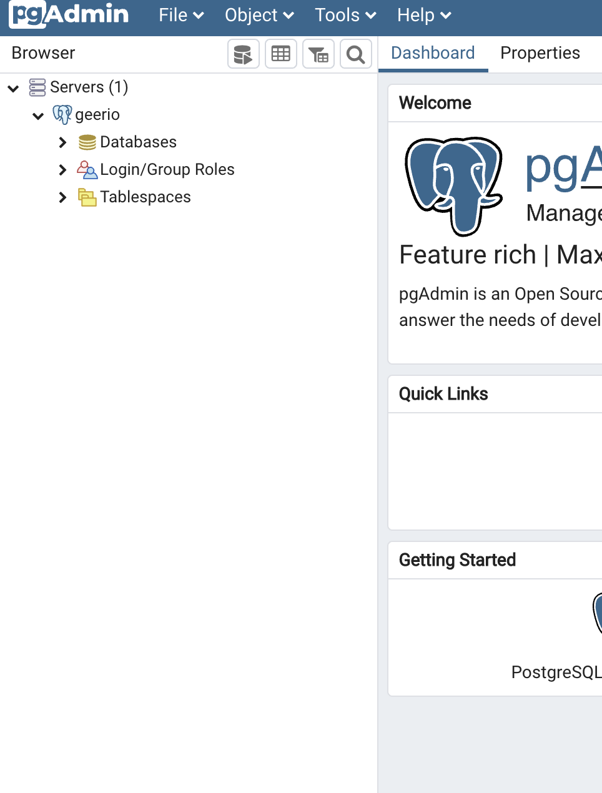

# 프로젝트 셋업 (20년 08월 15일)

> 도커 컴포를 활용하여 로컬 개발 환경 구성하기

## 개요

현재 날짜 20.08.16... 어제 계속 자서 15일 날 작업을 오늘에야 쓰고 있다. 오늘은 `docker-compose`를 이용해서 로컬 개발 환경 구성을 했다.


## 이전 작업

저번 작업은 `Flask` 프레임워크를 이용해 웹 앱을 만들고 그 후 `pytest`를 통해 간단하게 테스트 코드를 작성하여 앱의 동작을 확인했다. 


## 작업 내용

오늘은 도커와 도커 컴포즈를 이용해서, 로컬 개발 환경을 구성하였다. 어차피 웹 앱 외에 컴포넌트는 하나밖에 없다.

* postgresql

그래서 바로 작업을 했다. 그냥 로컬에다 하는거지만.. 혹시 몰라서 `github` 레포지토리를 팠다. [여기](https://github.com/gurumee92/geerio-local-development-env)를 참고해라.

더 자세히 뜯어보면 다음과 같다.

geerio-local-development-env/docker-compose.yml
```yml
version: '3'

services:
    postgresql:
        container_name: geerio-db
        image: postgres
        ports: 
            - 5432:5432
        environment:
            - POSTGRES_DB=geeriodb
            - POSTGRES_USER=test
            - POSTGRES_PASSWORD=test
            - POSTGRES_INITDB_ARGS=--encoding=UTF-8
        volumes: 
            - ./postgresql/init.sql:/docker-entrypoint-initdb.d/docker_postgres_init.sql
    
    pgadmin:
        container_name: pgadmin
        image: dpage/pgadmin4
        environment: 
            PGADMIN_DEFAULT_EMAIL: "test@test.com"
            PGADMIN_DEFAULT_PASSWORD: "test"
        ports: 
            - "8888:80"
        depends_on: 
            - postgresql  
```

2개의 컨테이너를 구성하였다. 하나는 `postgresql`, 다른 하나는 `pgadmin`이다. `postresql`은 데이터베이스 서버이며, `pgadmin`은 웹 UI로 `postgresql` 상태를 찾아볼 수 있다. 그리고 `postgresql` 컨테이너가 실행될 때, 웹 앱이 접속하는 데이터베이스 `geeriodb` 외에, 테스트 시 접속하게 될 `testdb`를 만들도록 하겠다.

`postgresql` 도커 컨테이너가 실행하게 될 때, 참고하는 파일은 `/docker-entrypoint-initdb.d/docker_postgres_init.sql`이다. 이것을 도커 컴포즈 레포지토리 내의 파일을 참조하도록 설정하겠다. 먼저 `volumes` 옵션을 살펴보라.

```yml
version: '3'

services:
    postgresql:
        # ...
        volumes: 
            - ./postgresql/init.sql:/docker-entrypoint-initdb.d/docker_postgres_init.sql

        # ...
```

`volumes`옵션은 `현재 파일 경로:도커 컨테이너 파일 경로` 이런 식으로 파일을 연결시킬 수 있다. 즉 다음은 현재 디렉토리에서 `./postgresql/init.sql` 파잃을 `/docker-entrypoint-initdb.d/docker_postgres_init.sql`을 연결시킨다는 뜻이다. 이 `init.sql`은 도커 컨테이너가 실행될 때, `testdb`를 만들고, 유저 `test`에게 접속 권한을 주는 것이다. 파일은 다음과 같다. 


geerio-local-development-env/postgresql/init.sql
```sql
CREATE DATABASE testdb
    WITH 
    OWNER = test
    ENCODING = 'UTF8'
    LC_COLLATE = 'en_US.utf8'
    LC_CTYPE = 'en_US.utf8'
    TABLESPACE = pg_default
    CONNECTION LIMIT = -1;
```

이제 컨테이너를 띄어보자.

```bash
$ docker-compose up --build
Creating geerio-db ... done
Creating pgadmin   ... done
Attaching to geerio-db, pgadmin
geerio-db     | The files belonging to this database system will be owned by user "postgres".
geerio-db     | This user must also own the server process.
geerio-db     | 
geerio-db     | The database cluster will be initialized with locale "en_US.utf8".
geerio-db     | The default text search configuration will be set to "english".
geerio-db     | 
# ...
```

그 후 `pgadmin`을 통해서 `postgresql`이 `geeriodb`, `testdb`를 만들었는지 확인해보자. 브라우저를 켜고 `localhost:8888`에 접속한다.


이제 email은 "test@test.com" 비밀번호는 "test"를 입력하고 접속한다. 그럼 다음 화면이 뜬다.


이제 "Add New Server"를 누른다. 그럼 다음 팝업 창이 뜬다.


그 후 "Name" 옆에 아무거나 치고 위 탭의 "Connection"으로 이동한다.


이제 "Host"에는 "geerio-db"를 입력한다. 그 후 Password에는 "test"를 입력한다. 그 후 save 버튼을 누른다. 그럼 왼쪽 탭에 다음이 생긴다.



이제 "Databases"를 눌러보자.


다음 3개의 데이터베이스가 보이면 성공이다.

* geeriodb
* testdb
* postgres (postgresql에서 자동으로 생성됨)


## 다음 작업

이제 다음 작업은 일단 `Flask-SQLAlchemy`를 통해서 웹 앱과 데이터베이스를 연동한다. 
