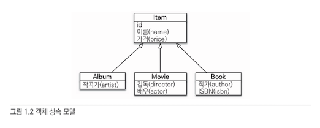
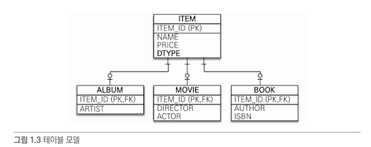

# 1장 JPA 소개

- 실무에서 데이터베이스를 사용하기 위해서는 객체 지향의 장점을 많이 포기해야 했다.
- 실제로 자바의 비즈니스 로직 보다 SQL, JDB API 등을 작성하는데 많은 시간을 써야 했다.
- JDBC Template이나 SQL Mapper등이 나와서 효율성이 많이 증가했지만 여전히 많은 단점이 존재했다.
- 객체 지향으로 코드를 짤 수록 객체와 데이터 베이스의 차이를 메우기 위해 더 많은 SQL 코드를 작성해야 했다.
- 객체와 관계형 데이터베이스 간의 차이를 중간에서 해결해주는 ORM 프레임워크가 나왔다.
- JPA를 처음 적용할 때는 러닝 커브가 존재하지만 반복적인 CRUD SQL 생산을 줄일 수 있었다.
- 성능 이슈도 있었지만 이것은 SQL 사용시에도 존재했던 이슈다.
- JPA는 자바 진영에서 만든 ORM 표준 기술이다.
- 개발자는 __SQL 매퍼가 아니다.__

## 1.1 SQL을 직접 다룰 때 발생하는 문제점

- 자바로 개발하는 대부분의 애플리케이션은 관계형 데이터 베이스를 저장소로 사용한다.

### 1.1.1 반복, 반복 그리고 반복

- 데이터 베이스는 객체 구조와 달리 데이터 중심의 구조를 가지고 있다.
- 이로 인해 반복적이고 비 생산적인 코드를 무수히 생산해내야 한다.
- 보통 DAO에서 이런 작업을 진행하는 데 지루함과 반복의 연속이다.

### 1.1.2 SQL에 의존적인 개발

- 요구사항이 바뀌어 테이블이 변경되면 연관된 객체는 물론 DAO 코드들이 모두 수정되어야 한다.
- 객체의 사용여부를 SQL에 의존적으로 개발할 수 밖에 없는 단점이 존재한다.
- 진정한 의미의 계층 분할이 어렵다.
- 엔티티(비즈니스 요구사항을 모델링한 객체)를 신뢰할 수 없다.
- SQL에 의존적인 개발을 피하기 어렵다.

### 1.1.3 JPA와 문제 해결

- JPA는 이러한 문제들을 해결하고 좀 더 객체지향적인 코드로 개발할 수 있게 도와 준다.
  - 저장
  - 조회
  - 수정
  - 연관된 객체 조회

## 1.2 패러다임의 불일치

- 관계형 데이터베이스는 데이터 중심으로 구조화되어 있고 집합적인 사고를 요구한다.
- 객체지향에서의 추상화, 상속, 다형성 같은 개념이 없다.
- 따라서 애플리케이션은 객체지향 언어로 개발하고 데이터는 관계형 데이터베이스에 저장해야 한다면 패러다임의 불일치는
개발자가 해결해주어야 한다.

### 1.2.1 상속



- 객체는 상속 기능이 있지만 테이블은 상속 기능이 없다.



- 테이블에서는 슈퍼타입 서브타입 관계를 사용해서 유사하게 설계할 수는 있다.
- ITEM 테이블의 DTYPE 컬럼을 사용해서 ALBUM, MOVIE, BOOK등을 자식 테이블로 관계를 설정했다.

- 데이터베이스를 사용하게 되면 INSERT를 통해 각 ITEM, ALBUM 테이블등에 같이 데이터를 넣어줘야하고 조회도 ITEM과 ALBUM을 조인해서 조회한 다음
결과를 ALBUM 객체를 생성해야한다.
- 패러다임의 불일치로 인해 많은 비용이 소모된다. 자바 컬레션에 이 데이터들을 담을 수 있다면 그냥 조회하고 추가해서 간단하게 사용할 수 있다.

#### JPA와 상속

- JPA는 상속과 관련된 패러다임의 불일치 문제를 개발자 대신 해결해준다.
- 자바 컬렉션에 저장하듯이 JPA에게 객체를 저장하면 된다.

```java
//저장  
jpa.persist(albmum);
//조회 
String albumId = "id1";
Album album = jpa.find(Album.class, albumId);
```

- JPA는 ITEM과 ALBUM 두 테이블을 조인해서 필요한 데이터를 조회하고 그 결과를 반환한다.

```sql
SELECT I.*, A.* FROM ITEM I JOIN ALBUM A ON I.ITEM_ID = A.ITEM_ID
```

### 1.2.2 연관 관계

- 객체는 참고를 사용해서 다른 객체와 연관관계를 가지고 참고에 접근해서 연관된 객체를 조회한다.
- 테이블은 외래 키를 사용해서 다른 테이블과 연관 관계를 가지고 조인을 사용해서 연관된 테이블을 조회한다.
- 위 이유로 인해 객체와 관계형 데이터베이스 사이의 패러다임 불일치가 발생한다.
- 객체는 참조가 있는 방향으로만 조회가 가능하지만 테이블은 양쪽 모두 가능하다.

#### 객체를 테이블에 맞추어 모델링

- 객체를 테이블에 맞춰 작성해보자.

```java
class Member {
  String id; //MEMEBER_ID 컬럼 
  Long teamId; //TEAM_ID FK 컬럼 <- 문제 발생!!! 
  String username; //USERNAME 컬럼 
}

class Team {
  Long id; //TEAM_ID PK 
  String name; //name 컬럼 
}
```

- 관계형 데이터 베이스는 조인 기능 때문에 외래의 키의 값을 그대로 보관할 수 있지만 객체는 연관된 객체의 참조를 보관해야 참고를 통해 
객체를 찾을 수 있다.

```
Team team = member.getTeam();
```

#### 객체지향 모델링

- 객체는 참조를 통해서 관계를 맺는다. 객체 지향적인 방법으로 다시 코드를 작성해보자.

```java
class Member {
  String id; //MEMEBER_ID 컬럼 
  Team team; //참조로 연관괸계를 맺는다. 
  String username; //USERNAME 컬럼
  
  Team getTeam() {
    return team;
  }
}

class Team {
  Long id; //TEAM_ID PK 
  String name; //name 컬럼
}
```

- 객체지향 모델링을 해도 두 패러다임을 맞추기가 쉽지 않다. 객체 모델은 참조를 사용해야하고 테이블은 참조가 필요 없고 외래키만 있으면 된다. 
- 결국 개발자가 중간 역할을 해줘야 한다.
- 이러한 과정들은 모두 패러다임 불일치를 해결하기 위해 소모되는 비용이다. 자바 컬렉션으로 저장한다면 이러한 이슈는 없어진다. 

### 1.2.3 객체 그래프 탐색 

```java 
Team team = member.getTeam();
```

- 참조를 통해서 연관된 객체를 찾는 것이 객체 그래프 탐색이다. 
- DB를 일단 생각을 접어두고 자바 객체만 생각했을 때는 참조 값만 있으면 해당하는 객체로 바로 접근해서 
그래프 탐색을 할 수 있다. 
- 그러나 실전에서는 SQL과 매핑(DAO)를 작성하는 사람과 실제 비즈니스 로직을 작성하는 사람이 다르다면 DAO 코드를 하나하나 보지 않는 이상
해당하는 쿼리가 얼만큼 데이터를 가져오는지 알 수 없기 때문에 객체 그래프 탐색을 사용할 수 없는 경우가 생긴다. (매우 불편하거나)
- SQL 의존적인 개발이 되어버린다. 우리는 객체 지향 언어인 자바를 쓰고 있고 나름 MVC 패턴등을 사용하여 계층을 분리하고 있음에도 불구하고...

### 1.2.4 비교

- 동일성 비교는 == 비교다. 객체 인스턴스의 주소 값을 비교한다. 
- 동등성 비교는 equals()메소드를 사용해서 객체 내부의 값을 비교한다.

```java
import java.lang.reflect.Member;

class MemberDAO {

  public Member getMember(String memberId) {
    String sql = "SELECT * FROM MEMBER WHERE MEMBER_ID = ?";
    ...

    return new Member(...); 
    
  }
}
```

```java
String memberId = "100";
Member member1 = memberDAO.getMember(memberId);
Member member2 = memberDAO.getMember(memberId);

member1 == member2;
```
- 위 값을 비교하면 어떻게 될까? 정답은 "false", 두 객체의 인스턴스 값은 다르다. 
- 그러나 자바 컬렉션이라고 생각하면 두 객체의 인스턴스 값은 같다. 

### 1.2.5 정리

- 객체 모델과 관계형 데이터베이스 모델을 지향하는 패러다임이 서로 다르다. 애초에 시작부터가 달랐고 해결하려는 문제 역시 다르다. 
- 문제는 이 차이를 극복하기 위해 개발자가 혹은 회사가 써야할 리소스가 너무 크고 인력 낭비가 크다. 실수할 확률도 더욱 올라간다.
- 물론 Mapper등으로 이러한 문제를 해결하려고 계속해서 노력을 해왔다. 

> 이러한 패러다임 문제들을 해결하기 위해 나온 것이 JPA 다. 

## 1.3 JPA란 무엇인가?

